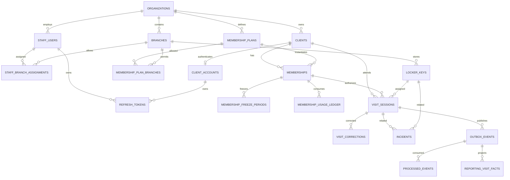

# Database Requirements — GymOps

## 1. Призначення документа

Цей документ є source of truth для PostgreSQL/Prisma моделі GymOps. Він визначає:

- план розвитку бази даних за фазами;
- ownership кожної таблиці;
- поля, типи, nullability та defaults;
- primary/foreign keys;
- unique/check/exclusion constraints;
- indexes і ключові query patterns;
- правила soft delete, retention та audit;
- concurrency, transaction та idempotency requirements;
- зв’язок кожної таблиці з user stories із `requirements.md`;
- вимоги до migrations та database-level tests.

Використовувати разом із:

- `requirements.md` — продуктова поведінка;
- `implementation-plan.md` — порядок реалізації;
- `architecture.md` — modules, services та environments;
- `ui-contract.md` — UI/frontend traceability.

Якщо Prisma schema, migration або repository суперечить цьому документу, зміна повинна бути узгоджена й одночасно внесена сюди та у пов’язані user stories.

---

## 2. Загальний план бази даних

### 2.1. MVP

```text
One PostgreSQL instance
  ├── identity schema
  ├── crm schema
  ├── membership schema
  ├── operations schema
  ├── audit schema
  └── platform schema
```

MVP починається як modular monolith. Одна БД потрібна для атомарних транзакцій check-in/check-out, але таблиці одразу мають чіткий module ownership.

### 2.2. Post-MVP microservices

```text
Identity DB
CRM/Membership DB
Operations DB
Reporting/Audit DB
```

Під час extraction заборонено робити shared writable database між незалежними services. Спочатку виділяється Reporting/Audit через transactional outbox; Operations зберігає Visits і Locker Keys разом.

### 2.3. PostgreSQL schemas

| Schema | Ownership |
|---|---|
| `identity` | Organizations, branches, staff/client authentication |
| `crm` | Client master data |
| `membership` | Plans, memberships, freezes, usage ledger |
| `operations` | Locker keys, visits, corrections, incidents |
| `platform` | Cross-cutting idempotency |
| `audit` | Append-only audit |
| `integration` | Outbox and consumer inbox |
| `reporting` | Rebuildable reporting read models |

Якщо multi-schema setup створює непропорційну tooling-складність на старті, дозволено тимчасово використовувати один physical schema. Logical ownership, DB IDs та table names при цьому не змінюються.

---

## 3. Реалізація за фазами

| Phase | Tables introduced/completed | Goal |
|---|---|---|
| 2 | `organizations`, `branches`, `staff_users`, `staff_branch_assignments`, `refresh_tokens` skeleton | DB connection, first migration, tenant/auth foundation |
| 4 | identity tables complete; `audit_logs` infrastructure | Auth, organizations, branches, first Gym Admin |
| 5 | `clients` | Staff and client CRM |
| 6 | `membership_plans`, `membership_plan_branches`, `memberships`, `membership_freeze_periods`, `membership_usage_ledger` | Membership lifecycle and eligibility |
| 7 | `locker_keys` | Key inventory |
| 8 | `visit_sessions`, `idempotency_records`; audit/ledger hardening | Atomic check-in/check-out, concurrency, history |
| 12 | `visit_corrections`, `incidents` | Corrections and operational incidents |
| 13 | Index/report-query hardening on source tables | MVP audit and reports |
| 14 | `client_accounts` and client refresh sessions | Optional client portal |
| 18 | `outbox_events`, `processed_events`, reporting read models | Event-driven Reporting/Audit extraction |
| 19 | Physical database split by service ownership | Independent service persistence |

---

## 4. Global database standards

### 4.1. Naming

- PostgreSQL tables/columns: `snake_case`.
- Prisma models/fields: `PascalCase` / `camelCase` mapped to physical names.
- Stable table requirement IDs: `DB-<DOMAIN>-NNN`.
- Primary keys: `uuid` generated by PostgreSQL or application with collision-safe UUID.
- Time fields: `timestamptz`, stored in UTC.
- Business dates: `date`, interpreted in branch timezone.

### 4.2. Standard columns

Mutable aggregate tables normally contain:

```text
id
created_at
updated_at
version
```

`version` increments on each mutation and supports optimistic concurrency. Append-only ledger/audit/event tables do not require mutable version fields.

### 4.3. Tenant isolation

- Every tenant-owned row stores `organization_id` even when it could be derived indirectly.
- Cross-module relations use tenant-safe composite foreign keys where practical.
- Backend queries always include tenant scope.
- IDs alone must never authorize access.
- Integration/API tests must prove IDOR and cross-organization denial.

### 4.4. Delete policy

No hard delete for:

- organizations;
- branches;
- staff users;
- clients;
- plans already assigned;
- memberships;
- locker keys already used;
- visits;
- corrections;
- incidents;
- audit records.

Technical records such as expired refresh tokens, old idempotency rows and processed-event markers may be purged by explicit retention jobs.

### 4.5. Sensitive data

- Passwords and refresh tokens are stored only as hashes.
- Audit/outbox payloads must exclude passwords, token hashes and unnecessary PII.
- RDS encryption at rest and TLS in transit are mandatory for staging/production.
- Database backups must follow the same access restrictions as the primary DB.

### 4.6. Constraint strategy

Critical business invariants are protected both by application services and PostgreSQL constraints/locks. Prisma migrations may include reviewed raw SQL for:

- partial unique indexes;
- exclusion constraints;
- advanced CHECK constraints;
- composite tenant-safe foreign keys.

---

## 5. High-level ERD



---

## 6. Table requirements

### 6.1. DB-ORG-001 — `identity.organizations`

**Owner:** Identity / Tenancy  
**Implementation phase:** Phase 2 bootstrap skeleton; full product lifecycle in Phase 14
**Related stories:** `ORG-01`, `ORG-02`, `ORG-03`, `AUTH-05`, `BRANCH-01`, `NFR-03`, `NFR-07`

**Purpose:** Stores each gym company or network and defines the top-level tenant boundary.

#### Fields

| Column | PostgreSQL type | Nullable | Default | Requirement |
|---|---|---:|---|---|
| `id` | `uuid` | NO | `gen_random_uuid()` | Primary key. |
| `code` | `varchar(40)` | NO | `—` | Stable human-readable tenant code; uppercase normalized. |
| `name` | `varchar(160)` | NO | `—` | Display name. |
| `legal_name` | `varchar(200)` | YES | `NULL` | Optional legal name. |
| `status` | `organization_status` | NO | `ACTIVE` | ACTIVE, SUSPENDED, DEACTIVATED. |
| `default_timezone` | `varchar(64)` | NO | `Europe/Kyiv` | IANA timezone used when a branch does not override it. |
| `deactivation_reason` | `varchar(500)` | YES | `NULL` | Required when status becomes DEACTIVATED. |
| `deactivated_at` | `timestamptz` | YES | `NULL` | Set on deactivation. |
| `created_by_staff_user_id` | `uuid` | YES | `NULL` | Bootstrap may create the first organization before a normal actor exists. |
| `created_at` | `timestamptz` | NO | `now()` | UTC. |
| `updated_at` | `timestamptz` | NO | `now()` | UTC. |
| `version` | `integer` | NO | `1` | Optimistic locking counter. |

#### Required constraints

- Primary key on `id`.
- Unique constraint on normalized `code`.
- `deactivation_reason` and `deactivated_at` are required when status is `DEACTIVATED`.
- Organization is never hard-deleted after related data exists.

#### Required indexes

- Unique `upper(code)`.
- `status` for Super Admin lists.

#### Lifecycle / retention

Status transition is controlled; deactivation is reversible only through an explicit admin action and audit record.

#### Required database tests

- Integration test: Cannot create duplicate organization code.
- Integration test: Deactivation must not delete branches, clients, visits or audit history.
- Migration test: table, constraints and indexes are reproducible on a clean PostgreSQL database.
- Tenant test: rows from another organization are not returned or mutated through repository/application service.

### 6.2. DB-ORG-002 — `identity.branches`

**Owner:** Identity / Tenancy  
**Implementation phase:** Phase 2 bootstrap skeleton; full product lifecycle in Phase 14
**Related stories:** `BRANCH-01`, `BRANCH-02`, `AUTH-05`, `KEY-01`, `VISIT-01`, `VISIT-05`, `VISIT-10`, `NFR-03`, `NFR-07`

**Purpose:** Stores physical gym locations and branch-level operational configuration.

#### Fields

| Column | PostgreSQL type | Nullable | Default | Requirement |
|---|---|---:|---|---|
| `id` | `uuid` | NO | `gen_random_uuid()` | Primary key. |
| `organization_id` | `uuid` | NO | `—` | Tenant FK to organizations. |
| `code` | `varchar(40)` | NO | `—` | Unique inside organization. |
| `name` | `varchar(160)` | NO | `—` | Display name. |
| `address_line_1` | `varchar(200)` | YES | `NULL` | Primary address line. |
| `address_line_2` | `varchar(200)` | YES | `NULL` | Optional address line. |
| `city` | `varchar(120)` | YES | `NULL` | City. |
| `timezone` | `varchar(64)` | NO | `—` | IANA timezone; initialized from organization default. |
| `status` | `branch_status` | NO | `ACTIVE` | ACTIVE or DEACTIVATED. |
| `auto_close_after_minutes` | `integer` | YES | `NULL` | Optional threshold for VISIT-10; NULL disables auto-close. |
| `deactivation_reason` | `varchar(500)` | YES | `NULL` | Required when deactivated. |
| `deactivated_at` | `timestamptz` | YES | `NULL` | UTC. |
| `created_at` | `timestamptz` | NO | `now()` | UTC. |
| `updated_at` | `timestamptz` | NO | `now()` | UTC. |
| `version` | `integer` | NO | `1` | Optimistic locking. |

#### Required constraints

- FK `organization_id -> organizations.id` with RESTRICT.
- Unique `(organization_id, upper(code))`.
- `auto_close_after_minutes > 0` when not NULL.
- Deactivated branch cannot accept new check-ins or new assignments.
- Composite unique `(id, organization_id)` supports tenant-safe foreign keys.

#### Required indexes

- `(organization_id, status)`.
- `(organization_id, name)` for admin search.

#### Lifecycle / retention

No hard delete after operational references exist.

#### Required database tests

- Integration test: Branch timezone is required.
- Integration test: Branch organization cannot change after operational data exists.
- Migration test: table, constraints and indexes are reproducible on a clean PostgreSQL database.
- Tenant test: rows from another organization are not returned or mutated through repository/application service.

### 6.3. DB-IDN-001 — `identity.staff_users`

**Owner:** Identity  
**Implementation phase:** Phase 2 skeleton; MVP authentication/staff use in Phases 4–5; advanced lifecycle in Phases 14–15
**Related stories:** `AUTH-01`, `AUTH-04`, `AUTH-05`, `STAFF-01`, `STAFF-02`, `STAFF-03`, `STAFF-04`, `REPORT-03`, `NFR-03`

**Purpose:** Stores staff identities for SUPER_ADMIN, GYM_ADMIN and EMPLOYEE.

#### Fields

| Column | PostgreSQL type | Nullable | Default | Requirement |
|---|---|---:|---|---|
| `id` | `uuid` | NO | `gen_random_uuid()` | Primary key. |
| `organization_id` | `uuid` | YES | `NULL` | NULL only for platform SUPER_ADMIN. |
| `email` | `varchar(254)` | NO | `—` | Original display email. |
| `email_normalized` | `varchar(254)` | NO | `—` | Lowercase trimmed email used for uniqueness/login. |
| `password_hash` | `varchar(255)` | NO | `—` | Strong one-way password hash; never plaintext. |
| `first_name` | `varchar(100)` | NO | `—` | First name. |
| `last_name` | `varchar(100)` | NO | `—` | Last name. |
| `phone` | `varchar(32)` | YES | `NULL` | Display phone. |
| `phone_normalized` | `varchar(32)` | YES | `NULL` | E.164-like normalized value when possible. |
| `role` | `staff_role` | NO | `—` | SUPER_ADMIN, GYM_ADMIN, EMPLOYEE. |
| `status` | `staff_status` | NO | `INVITED` | INVITED, ACTIVE, DEACTIVATED, LOCKED. |
| `failed_login_count` | `integer` | NO | `0` | Security counter. |
| `locked_until` | `timestamptz` | YES | `NULL` | Temporary lock expiration. |
| `last_login_at` | `timestamptz` | YES | `NULL` | Last successful login. |
| `password_changed_at` | `timestamptz` | YES | `NULL` | Password rotation timestamp. |
| `deactivated_at` | `timestamptz` | YES | `NULL` | UTC. |
| `created_by_staff_user_id` | `uuid` | YES | `NULL` | Self-reference; bootstrap may be NULL. |
| `created_at` | `timestamptz` | NO | `now()` | UTC. |
| `updated_at` | `timestamptz` | NO | `now()` | UTC. |
| `version` | `integer` | NO | `1` | Optimistic locking. |

#### Required constraints

- Unique `email_normalized` globally.
- SUPER_ADMIN requires `organization_id IS NULL`; other roles require organization.
- `failed_login_count >= 0`.
- No hard delete; deactivation revokes active refresh tokens.
- Composite unique `(id, organization_id)` for tenant-safe references where applicable.

#### Required indexes

- Unique `email_normalized`.
- `(organization_id, role, status)`.
- `(organization_id, last_name, first_name)`.

#### Lifecycle / retention

INVITED → ACTIVE → DEACTIVATED; LOCKED is temporary/security-driven.

#### Required database tests

- Integration test: Password hash is never returned by API or copied to audit `new_values`.
- Integration test: Role escalation requires privileged action and audit.
- Migration test: table, constraints and indexes are reproducible on a clean PostgreSQL database.
- Tenant test: rows from another organization are not returned or mutated through repository/application service.

### 6.4. DB-IDN-002 — `identity.staff_branch_assignments`

**Owner:** Identity  
**Implementation phase:** Phase 2 skeleton; MVP branch scope in Phases 4–5; advanced reassignment in Phases 14–15
**Related stories:** `AUTH-05`, `STAFF-01`, `STAFF-02`, `STAFF-03`, `STAFF-04`, `NFR-03`, `NFR-07`

**Purpose:** Assigns Gym Admins and Employees to allowed branches while preserving assignment history.

#### Fields

| Column | PostgreSQL type | Nullable | Default | Requirement |
|---|---|---:|---|---|
| `id` | `uuid` | NO | `gen_random_uuid()` | Primary key. |
| `organization_id` | `uuid` | NO | `—` | Tenant scope duplicated for composite FKs. |
| `staff_user_id` | `uuid` | NO | `—` | Staff user. |
| `branch_id` | `uuid` | NO | `—` | Allowed branch. |
| `is_primary` | `boolean` | NO | `false` | Primary branch for default UI context. |
| `assigned_by_staff_user_id` | `uuid` | YES | `NULL` | Actor. |
| `assigned_at` | `timestamptz` | NO | `now()` | UTC. |
| `revoked_by_staff_user_id` | `uuid` | YES | `NULL` | Actor who revoked. |
| `revoked_at` | `timestamptz` | YES | `NULL` | NULL means active assignment. |

#### Required constraints

- Tenant-safe composite FKs to staff user and branch.
- At most one active assignment per `(staff_user_id, branch_id)` via partial unique index.
- At most one active primary assignment per staff user via partial unique index.
- SUPER_ADMIN does not need branch assignments.

#### Required indexes

- Partial unique active `(staff_user_id, branch_id) WHERE revoked_at IS NULL`.
- Partial unique primary `(staff_user_id) WHERE revoked_at IS NULL AND is_primary`.
- `(organization_id, branch_id, revoked_at)`.

#### Lifecycle / retention

Assignments are revoked, not deleted.

#### Required database tests

- Integration test: Cannot assign staff to a branch in another organization.
- Migration test: table, constraints and indexes are reproducible on a clean PostgreSQL database.
- Tenant test: rows from another organization are not returned or mutated through repository/application service.

### 6.5. DB-IDN-003 — `identity.refresh_tokens`

**Owner:** Identity  
**Implementation phase:** Phase 2 skeleton; staff authentication completed in Phase 4 and extended for Client Portal in Phase 19
**Related stories:** `AUTH-01`, `AUTH-02`, `AUTH-03`, `STAFF-04`, `PORTAL-01`, `NFR-02`, `NFR-03`

**Purpose:** Stores hashed refresh-token sessions for staff and optional client portal accounts.

#### Fields

| Column | PostgreSQL type | Nullable | Default | Requirement |
|---|---|---:|---|---|
| `id` | `uuid` | NO | `gen_random_uuid()` | Session/token identifier. |
| `staff_user_id` | `uuid` | YES | `NULL` | Exactly one principal FK is required. |
| `client_account_id` | `uuid` | YES | `NULL` | Post-MVP principal. |
| `token_hash` | `varchar(255)` | NO | `—` | Only hash is stored. |
| `family_id` | `uuid` | NO | `gen_random_uuid()` | Supports rotation/reuse detection. |
| `issued_at` | `timestamptz` | NO | `now()` | UTC. |
| `expires_at` | `timestamptz` | NO | `—` | UTC. |
| `revoked_at` | `timestamptz` | YES | `NULL` | Set on logout/deactivation/reuse. |
| `revoke_reason` | `varchar(120)` | YES | `NULL` | Reason code. |
| `replaced_by_token_id` | `uuid` | YES | `NULL` | Rotation chain. |
| `ip_hash` | `varchar(128)` | YES | `NULL` | Optional privacy-preserving source fingerprint. |
| `user_agent` | `varchar(500)` | YES | `NULL` | Optional troubleshooting field. |

#### Required constraints

- Exactly one of `staff_user_id` or `client_account_id` is non-NULL.
- `expires_at > issued_at`.
- Unique `token_hash`.
- Revoked/expired tokens cannot refresh a session.

#### Required indexes

- Unique `token_hash`.
- `(staff_user_id, revoked_at, expires_at)`.
- `(client_account_id, revoked_at, expires_at)`.
- `family_id`.

#### Lifecycle / retention

Expired and revoked records may be purged by a configurable retention job after an operational grace period.

#### Required database tests

- Integration test: Raw refresh token is never persisted or logged.
- Migration test: table, constraints and indexes are reproducible on a clean PostgreSQL database.
- Tenant test: rows from another organization are not returned or mutated through repository/application service.

### 6.6. DB-CRM-001 — `crm.clients`

**Owner:** CRM  
**Implementation phase:** Phase 5; edit/block lifecycle extended in Phase 15
**Related stories:** `CLIENT-01`, `CLIENT-02`, `CLIENT-03`, `CLIENT-04`, `CLIENT-05`, `MEMBERSHIP-01`, `VISIT-01`, `VISIT-05`, `VISIT-08`, `PORTAL-01`, `PORTAL-02`, `NFR-01`, `NFR-03`

**Purpose:** Stores gym clients as tenant-scoped CRM records.

#### Fields

| Column | PostgreSQL type | Nullable | Default | Requirement |
|---|---|---:|---|---|
| `id` | `uuid` | NO | `gen_random_uuid()` | Primary key. |
| `organization_id` | `uuid` | NO | `—` | Tenant. |
| `home_branch_id` | `uuid` | YES | `NULL` | Optional preferred branch. |
| `client_number` | `varchar(40)` | NO | `—` | Human-facing stable identifier unique in organization. |
| `first_name` | `varchar(100)` | NO | `—` | First name. |
| `last_name` | `varchar(100)` | NO | `—` | Last name. |
| `search_name` | `varchar(220)` | NO | `—` | Normalized searchable full name. |
| `email` | `varchar(254)` | YES | `NULL` | Display email. |
| `email_normalized` | `varchar(254)` | YES | `NULL` | Lowercase search value; not necessarily unique in MVP. |
| `phone` | `varchar(32)` | YES | `NULL` | Display phone. |
| `phone_normalized` | `varchar(32)` | YES | `NULL` | Normalized search value. |
| `date_of_birth` | `date` | YES | `NULL` | Optional; avoid exposing unnecessarily. |
| `status` | `client_status` | NO | `ACTIVE` | ACTIVE, BLOCKED, ARCHIVED. |
| `block_reason` | `varchar(500)` | YES | `NULL` | Required for BLOCKED. |
| `notes` | `text` | YES | `NULL` | Operational note; must not contain secrets. |
| `created_by_staff_user_id` | `uuid` | NO | `—` | Actor. |
| `updated_by_staff_user_id` | `uuid` | YES | `NULL` | Last actor. |
| `created_at` | `timestamptz` | NO | `now()` | UTC. |
| `updated_at` | `timestamptz` | NO | `now()` | UTC. |
| `archived_at` | `timestamptz` | YES | `NULL` | No hard delete. |
| `version` | `integer` | NO | `1` | Optimistic locking. |

#### Required constraints

- Unique `(organization_id, client_number)`.
- Tenant-safe FK for `home_branch_id`.
- BLOCKED requires `block_reason`.
- At least one contact method is recommended but not DB-mandatory.
- Composite unique `(id, organization_id)`.

#### Required indexes

- `(organization_id, status)`.
- `(organization_id, search_name)`.
- `(organization_id, phone_normalized)`.
- `(organization_id, email_normalized)`.
- Optional trigram index on `search_name` after baseline measurement.

#### Lifecycle / retention

ACTIVE → BLOCKED/ARCHIVED; records with visits are never hard-deleted.

#### Required database tests

- Integration test: Client data never crosses organization boundary.
- Integration test: Duplicate detection is application-assisted; only client_number is strictly unique.
- Migration test: table, constraints and indexes are reproducible on a clean PostgreSQL database.
- Tenant test: rows from another organization are not returned or mutated through repository/application service.

### 6.7. DB-MEM-001 — `membership.membership_plans`

**Owner:** Membership  
**Implementation phase:** Phase 6
**Related stories:** `PLAN-01`, `MEMBERSHIP-01`, `MEMBERSHIP-02`, `MEMBERSHIP-04`, `NFR-07`

**Purpose:** Stores reusable membership plan definitions.

#### Fields

| Column | PostgreSQL type | Nullable | Default | Requirement |
|---|---|---:|---|---|
| `id` | `uuid` | NO | `gen_random_uuid()` | Primary key. |
| `organization_id` | `uuid` | NO | `—` | Tenant. |
| `code` | `varchar(40)` | NO | `—` | Unique plan code in organization. |
| `name` | `varchar(160)` | NO | `—` | Display name. |
| `description` | `text` | YES | `NULL` | Optional. |
| `plan_type` | `membership_plan_type` | NO | `—` | UNLIMITED, LIMITED_VISITS, SINGLE_VISIT, TRIAL, CORPORATE. |
| `duration_days` | `integer` | YES | `NULL` | Required for day-based plans. |
| `visit_limit` | `integer` | YES | `NULL` | Required for limited/single visit types. |
| `allows_freeze` | `boolean` | NO | `false` | Whether freezing is allowed. |
| `max_freeze_days` | `integer` | YES | `NULL` | Required or bounded when freeze is enabled. |
| `status` | `membership_plan_status` | NO | `ACTIVE` | ACTIVE, INACTIVE. |
| `created_by_staff_user_id` | `uuid` | NO | `—` | Actor. |
| `created_at` | `timestamptz` | NO | `now()` | UTC. |
| `updated_at` | `timestamptz` | NO | `now()` | UTC. |
| `version` | `integer` | NO | `1` | Optimistic locking. |

#### Required constraints

- Unique `(organization_id, upper(code))`.
- `duration_days > 0` when set.
- `visit_limit > 0` when set.
- LIMITED_VISITS and SINGLE_VISIT require visit_limit; UNLIMITED requires NULL.
- `max_freeze_days > 0` only when allows_freeze is true.
- Composite unique `(id, organization_id)`.

#### Required indexes

- `(organization_id, status)`.
- `(organization_id, name)`.

#### Lifecycle / retention

Plans are deactivated, not deleted after assignment.

#### Required database tests

- Integration test: Editing a plan does not mutate membership snapshots already assigned.
- Migration test: table, constraints and indexes are reproducible on a clean PostgreSQL database.
- Tenant test: rows from another organization are not returned or mutated through repository/application service.

### 6.8. DB-MEM-002 — `membership.membership_plan_branches`

**Owner:** Membership  
**Implementation phase:** Phase 6
**Related stories:** `PLAN-01`, `MEMBERSHIP-01`, `MEMBERSHIP-02`, `VISIT-01`, `NFR-07`

**Purpose:** Defines in which branches a membership plan is valid; no rows means all active branches in the organization unless product rules choose explicit-only mode.

#### Fields

| Column | PostgreSQL type | Nullable | Default | Requirement |
|---|---|---:|---|---|
| `id` | `uuid` | NO | `gen_random_uuid()` | Primary key. |
| `organization_id` | `uuid` | NO | `—` | Tenant. |
| `membership_plan_id` | `uuid` | NO | `—` | Plan. |
| `branch_id` | `uuid` | NO | `—` | Allowed branch. |
| `created_at` | `timestamptz` | NO | `now()` | UTC. |

#### Required constraints

- Unique `(membership_plan_id, branch_id)`.
- Tenant-safe composite FKs to plan and branch.

#### Required indexes

- `(organization_id, branch_id)`.
- `membership_plan_id`.

#### Lifecycle / retention

Rows may be added/removed before or after assignment; historical visit validity is preserved by visit snapshot.

#### Required database tests

- Integration test: Application must define whether empty set means all branches; MVP default: all active branches.
- Migration test: table, constraints and indexes are reproducible on a clean PostgreSQL database.
- Tenant test: rows from another organization are not returned or mutated through repository/application service.

### 6.9. DB-MEM-003 — `membership.memberships`

**Owner:** Membership  
**Implementation phase:** Phase 6
**Related stories:** `MEMBERSHIP-01`, `MEMBERSHIP-02`, `MEMBERSHIP-03`, `MEMBERSHIP-04`, `CLIENT-03`, `CLIENT-05`, `VISIT-01`, `VISIT-09`, `NFR-07`

**Purpose:** Stores a plan assigned to a specific client, including immutable commercial/eligibility snapshot fields.

#### Fields

| Column | PostgreSQL type | Nullable | Default | Requirement |
|---|---|---:|---|---|
| `id` | `uuid` | NO | `gen_random_uuid()` | Primary key. |
| `organization_id` | `uuid` | NO | `—` | Tenant. |
| `client_id` | `uuid` | NO | `—` | Client. |
| `membership_plan_id` | `uuid` | NO | `—` | Source plan. |
| `status` | `membership_status` | NO | `ACTIVE` | ACTIVE, FROZEN, EXPIRED, BLOCKED, CANCELLED. |
| `starts_on` | `date` | NO | `—` | Branch-local business date. |
| `ends_on` | `date` | YES | `NULL` | NULL only if business rules allow open-ended membership. |
| `plan_code_snapshot` | `varchar(40)` | NO | `—` | Immutable snapshot. |
| `plan_name_snapshot` | `varchar(160)` | NO | `—` | Immutable snapshot. |
| `plan_type_snapshot` | `membership_plan_type` | NO | `—` | Immutable snapshot. |
| `visit_limit_snapshot` | `integer` | YES | `NULL` | Immutable. |
| `duration_days_snapshot` | `integer` | YES | `NULL` | Immutable. |
| `visits_used` | `integer` | NO | `0` | Transactionally updated counter. |
| `blocked_reason` | `varchar(500)` | YES | `NULL` | Required when BLOCKED. |
| `assigned_by_staff_user_id` | `uuid` | NO | `—` | Actor. |
| `created_at` | `timestamptz` | NO | `now()` | UTC. |
| `updated_at` | `timestamptz` | NO | `now()` | UTC. |
| `version` | `integer` | NO | `1` | Optimistic locking. |

#### Required constraints

- Tenant-safe FKs to client and plan.
- `ends_on >= starts_on` when set.
- `visits_used >= 0`.
- `visits_used <= visit_limit_snapshot` when limit exists.
- BLOCKED requires reason.
- Composite unique `(id, organization_id)`.

#### Required indexes

- `(organization_id, client_id, status)`.
- `(organization_id, status, ends_on)`.
- Partial index for eligible memberships (`status=ACTIVE`).

#### Lifecycle / retention

Status changes are audited; no hard delete.

#### Required database tests

- Integration test: Eligibility is calculated from status, dates, freeze periods, branch scope and remaining visits.
- Migration test: table, constraints and indexes are reproducible on a clean PostgreSQL database.
- Tenant test: rows from another organization are not returned or mutated through repository/application service.

### 6.10. DB-MEM-004 — `membership.membership_freeze_periods`

**Owner:** Membership  
**Implementation phase:** Phase 16
**Related stories:** `MEMBERSHIP-03`, `MEMBERSHIP-02`, `NFR-04`, `NFR-07`

**Purpose:** Preserves freeze history instead of overwriting membership dates without trace.

#### Fields

| Column | PostgreSQL type | Nullable | Default | Requirement |
|---|---|---:|---|---|
| `id` | `uuid` | NO | `gen_random_uuid()` | Primary key. |
| `organization_id` | `uuid` | NO | `—` | Tenant. |
| `membership_id` | `uuid` | NO | `—` | Membership. |
| `starts_on` | `date` | NO | `—` | Inclusive local business date. |
| `ends_on` | `date` | NO | `—` | Inclusive local business date. |
| `status` | `membership_freeze_status` | NO | `ACTIVE` | ACTIVE, ENDED, CANCELLED. |
| `reason` | `varchar(500)` | NO | `—` | Required. |
| `created_by_staff_user_id` | `uuid` | NO | `—` | Actor. |
| `ended_by_staff_user_id` | `uuid` | YES | `NULL` | Actor. |
| `created_at` | `timestamptz` | NO | `now()` | UTC. |
| `updated_at` | `timestamptz` | NO | `now()` | UTC. |

#### Required constraints

- `ends_on >= starts_on`.
- No overlapping non-cancelled freeze periods for the same membership.
- Tenant-safe FK to membership.

#### Required indexes

- `(membership_id, status, starts_on, ends_on)`.
- Exclusion/overlap protection implemented with PostgreSQL range constraint or transaction lock.

#### Lifecycle / retention

Append/history table; cancellation changes status but does not delete the record.

#### Required database tests

- Integration test: Freeze cannot exceed plan policy; enforced in application and integration tests.
- Migration test: table, constraints and indexes are reproducible on a clean PostgreSQL database.
- Tenant test: rows from another organization are not returned or mutated through repository/application service.

### 6.11. DB-MEM-005 — `membership.membership_usage_ledger`

**Owner:** Membership  
**Implementation phase:** Phase 6 foundation; critical transactional use in Phase 7
**Related stories:** `MEMBERSHIP-04`, `VISIT-01`, `VISIT-04`, `VISIT-06`, `VISIT-09`, `AUDIT-01`, `NFR-04`, `NFR-07`

**Purpose:** Append-only ledger for visit consumption, reversal and manual adjustment.

#### Fields

| Column | PostgreSQL type | Nullable | Default | Requirement |
|---|---|---:|---|---|
| `id` | `uuid` | NO | `gen_random_uuid()` | Primary key. |
| `organization_id` | `uuid` | NO | `—` | Tenant. |
| `membership_id` | `uuid` | NO | `—` | Membership. |
| `visit_session_id` | `uuid` | YES | `NULL` | Related visit; may be NULL for admin adjustment. |
| `entry_type` | `membership_usage_type` | NO | `—` | CONSUME, REVERSE, ADJUST. |
| `quantity` | `integer` | NO | `—` | Signed non-zero amount; CONSUME normally +1, REVERSE -1. |
| `reason_code` | `varchar(80)` | NO | `—` | Machine-readable reason. |
| `reason_text` | `varchar(500)` | YES | `NULL` | Required for manual adjustment. |
| `idempotency_key` | `varchar(160)` | YES | `NULL` | Links command retry protection. |
| `created_by_staff_user_id` | `uuid` | YES | `NULL` | System jobs may be NULL. |
| `created_at` | `timestamptz` | NO | `now()` | UTC. |

#### Required constraints

- Append-only: no normal update/delete path.
- `quantity <> 0`.
- Unique visit consumption per `(membership_id, visit_session_id, entry_type)` where visit is not NULL.
- Tenant-safe FKs.
- Manual ADJUST requires reason_text.

#### Required indexes

- `(membership_id, created_at)`.
- `visit_session_id`.
- Unique/partial index preventing duplicate consumption.

#### Lifecycle / retention

Retained with membership/visit history.

#### Required database tests

- Integration test: Membership counter and ledger insert occur in the same transaction.
- Migration test: table, constraints and indexes are reproducible on a clean PostgreSQL database.
- Tenant test: rows from another organization are not returned or mutated through repository/application service.

### 6.12. DB-OPS-001 — `operations.locker_keys`

**Owner:** Operations  
**Implementation phase:** Phase 6; advanced status transitions in Phase 16
**Related stories:** `KEY-01`, `KEY-02`, `KEY-03`, `VISIT-01`, `VISIT-03`, `VISIT-05`, `VISIT-06`, `INCIDENT-01`, `INCIDENT-02`, `REPORT-02`, `NFR-07`

**Purpose:** Stores physical locker keys and their current operational status.

#### Fields

| Column | PostgreSQL type | Nullable | Default | Requirement |
|---|---|---:|---|---|
| `id` | `uuid` | NO | `gen_random_uuid()` | Primary key. |
| `organization_id` | `uuid` | NO | `—` | Tenant. |
| `branch_id` | `uuid` | NO | `—` | Physical branch. |
| `key_number` | `varchar(40)` | NO | `—` | Reception-facing identifier. |
| `locker_number` | `varchar(40)` | YES | `NULL` | Optional locker identifier. |
| `status` | `locker_key_status` | NO | `AVAILABLE` | AVAILABLE, ISSUED, LOST, DAMAGED, MAINTENANCE, DEACTIVATED. |
| `status_reason` | `varchar(500)` | YES | `NULL` | Required for LOST/DAMAGED/MAINTENANCE/DEACTIVATED. |
| `created_by_staff_user_id` | `uuid` | NO | `—` | Actor. |
| `created_at` | `timestamptz` | NO | `now()` | UTC. |
| `updated_at` | `timestamptz` | NO | `now()` | UTC. |
| `version` | `integer` | NO | `1` | Optimistic locking. |

#### Required constraints

- Unique `(branch_id, upper(key_number))`.
- Tenant-safe branch FK.
- ISSUED status must correspond to exactly one ACTIVE visit; validated transactionally and by reconciliation check.
- Status requiring reason cannot have empty reason.
- Composite unique `(id, organization_id, branch_id)`.

#### Required indexes

- `(organization_id, branch_id, status)`.
- `(branch_id, key_number)` for checkout lookup.

#### Lifecycle / retention

Never hard-delete after use; DEACTIVATED is terminal unless explicitly restored by admin.

#### Required database tests

- Integration test: Only AVAILABLE key can be issued.
- Integration test: Key cannot move to AVAILABLE while an ACTIVE visit references it.
- Migration test: table, constraints and indexes are reproducible on a clean PostgreSQL database.
- Tenant test: rows from another organization are not returned or mutated through repository/application service.

### 6.13. DB-OPS-002 — `operations.visit_sessions`

**Owner:** Operations  
**Implementation phase:** Phase 7
**Related stories:** `VISIT-01`, `VISIT-02`, `VISIT-03`, `VISIT-04`, `VISIT-05`, `VISIT-06`, `VISIT-07`, `VISIT-08`, `VISIT-09`, `VISIT-10`, `INCIDENT-01`, `REPORT-01`, `REPORT-02`, `REPORT-03`, `PORTAL-02`, `EVENT-01`, `NFR-01`, `NFR-07`

**Purpose:** Stores every client workout/check-in session and the authoritative active/completed state.

#### Fields

| Column | PostgreSQL type | Nullable | Default | Requirement |
|---|---|---:|---|---|
| `id` | `uuid` | NO | `gen_random_uuid()` | Primary key. |
| `organization_id` | `uuid` | NO | `—` | Tenant. |
| `branch_id` | `uuid` | NO | `—` | Visit branch. |
| `client_id` | `uuid` | NO | `—` | Client. |
| `membership_id` | `uuid` | NO | `—` | Membership used. |
| `locker_key_id` | `uuid` | NO | `—` | Issued key. |
| `status` | `visit_status` | NO | `ACTIVE` | ACTIVE, COMPLETED, CANCELLED, AUTO_CLOSED, INCIDENT, CORRECTED. |
| `started_at` | `timestamptz` | NO | `—` | UTC; entered by employee or server default. |
| `finished_at` | `timestamptz` | YES | `NULL` | UTC; NULL for active visit. |
| `duration_seconds` | `integer` | YES | `NULL` | Stored when closed for stable reporting. |
| `check_in_by_staff_user_id` | `uuid` | NO | `—` | Actor. |
| `check_out_by_staff_user_id` | `uuid` | YES | `NULL` | Actor or NULL for system auto-close. |
| `source` | `visit_source` | NO | `RECEPTION` | RECEPTION, ADMIN_CORRECTION, SYSTEM_AUTO_CLOSE, CLIENT_PORTAL_FUTURE. |
| `membership_snapshot` | `jsonb` | NO | `{}` | Plan code/name/type/limits/status/date snapshot at check-in. |
| `check_in_correlation_id` | `uuid` | NO | `—` | Traceability. |
| `check_out_correlation_id` | `uuid` | YES | `NULL` | Traceability. |
| `closed_reason` | `varchar(500)` | YES | `NULL` | Required for cancel/auto-close/incident as applicable. |
| `created_at` | `timestamptz` | NO | `now()` | UTC. |
| `updated_at` | `timestamptz` | NO | `now()` | UTC. |
| `version` | `integer` | NO | `1` | Optimistic locking. |

#### Required constraints

- Tenant-safe composite FKs to branch, client, membership and key.
- Partial unique `(organization_id, client_id) WHERE status = ACTIVE`.
- Partial unique `(branch_id, locker_key_id) WHERE status = ACTIVE`.
- ACTIVE requires `finished_at IS NULL`; closed states require finished_at.
- `finished_at >= started_at`.
- `duration_seconds >= 0` and consistent with timestamps within rounding tolerance.
- Membership and client must belong to same organization.

#### Required indexes

- Partial unique active client.
- Partial unique active key.
- `(organization_id, branch_id, status, started_at)`.
- `(organization_id, client_id, started_at DESC)`.
- `(branch_id, locker_key_id, status)`.
- `(organization_id, started_at)` for reports.

#### Lifecycle / retention

Append/history record. Critical fields change only via explicit state transitions or correction workflow.

#### Required database tests

- Integration test: Check-in and key issue are one transaction.
- Integration test: Check-out and key release are one transaction.
- Integration test: Direct UPDATE bypassing service is forbidden.
- Migration test: table, constraints and indexes are reproducible on a clean PostgreSQL database.
- Tenant test: rows from another organization are not returned or mutated through repository/application service.

### 6.14. DB-OPS-003 — `operations.visit_corrections`

**Owner:** Operations  
**Implementation phase:** Phase 17
**Related stories:** `VISIT-09`, `AUDIT-01`, `AUDIT-02`, `NFR-04`, `NFR-07`

**Purpose:** Append-only record of manual visit corrections with before/after values and reason.

#### Fields

| Column | PostgreSQL type | Nullable | Default | Requirement |
|---|---|---:|---|---|
| `id` | `uuid` | NO | `gen_random_uuid()` | Primary key. |
| `organization_id` | `uuid` | NO | `—` | Tenant. |
| `visit_session_id` | `uuid` | NO | `—` | Corrected visit. |
| `correction_type` | `visit_correction_type` | NO | `—` | TIME, KEY, MEMBERSHIP, STATUS, CLIENT, OTHER. |
| `old_values` | `jsonb` | NO | `—` | Whitelisted pre-change fields. |
| `new_values` | `jsonb` | NO | `—` | Whitelisted post-change fields. |
| `reason` | `varchar(1000)` | NO | `—` | Human reason. |
| `corrected_by_staff_user_id` | `uuid` | NO | `—` | Gym Admin. |
| `correlation_id` | `uuid` | NO | `—` | Request trace. |
| `created_at` | `timestamptz` | NO | `now()` | UTC. |

#### Required constraints

- Append-only.
- Old/new values cannot be identical.
- Tenant-safe visit and actor FKs.
- Only permitted fields can appear in JSON payload.

#### Required indexes

- `(visit_session_id, created_at)`.
- `(organization_id, corrected_by_staff_user_id, created_at)`.

#### Lifecycle / retention

Never edited or deleted through application API.

#### Required database tests

- Integration test: Correction and visit update occur in one transaction together with audit and possible membership/key reconciliation.
- Migration test: table, constraints and indexes are reproducible on a clean PostgreSQL database.
- Tenant test: rows from another organization are not returned or mutated through repository/application service.

### 6.15. DB-OPS-004 — `operations.incidents`

**Owner:** Operations  
**Implementation phase:** Phase 17
**Related stories:** `INCIDENT-01`, `INCIDENT-02`, `INCIDENT-03`, `KEY-03`, `VISIT-09`, `AUDIT-01`, `AUDIT-02`, `NFR-04`

**Purpose:** Stores operational incidents such as lost/damaged keys and problematic sessions.

#### Fields

| Column | PostgreSQL type | Nullable | Default | Requirement |
|---|---|---:|---|---|
| `id` | `uuid` | NO | `gen_random_uuid()` | Primary key. |
| `organization_id` | `uuid` | NO | `—` | Tenant. |
| `branch_id` | `uuid` | NO | `—` | Branch. |
| `visit_session_id` | `uuid` | YES | `NULL` | Related visit. |
| `client_id` | `uuid` | YES | `NULL` | Related client. |
| `locker_key_id` | `uuid` | YES | `NULL` | Related key. |
| `incident_type` | `incident_type` | NO | `—` | LOST_KEY, DAMAGED_KEY, LEFT_WITH_KEY, INCORRECT_ASSIGNMENT, MEMBERSHIP_CONFLICT, OTHER. |
| `severity` | `incident_severity` | NO | `MEDIUM` | LOW, MEDIUM, HIGH, CRITICAL. |
| `status` | `incident_status` | NO | `OPEN` | OPEN, IN_PROGRESS, RESOLVED, CANCELLED. |
| `summary` | `varchar(200)` | NO | `—` | Short description. |
| `description` | `text` | YES | `NULL` | Details. |
| `reported_by_staff_user_id` | `uuid` | NO | `—` | Actor. |
| `assigned_to_staff_user_id` | `uuid` | YES | `NULL` | Owner. |
| `resolved_by_staff_user_id` | `uuid` | YES | `NULL` | Resolver. |
| `resolution` | `text` | YES | `NULL` | Required for RESOLVED. |
| `reported_at` | `timestamptz` | NO | `now()` | UTC. |
| `resolved_at` | `timestamptz` | YES | `NULL` | UTC. |
| `updated_at` | `timestamptz` | NO | `now()` | UTC. |
| `version` | `integer` | NO | `1` | Optimistic locking. |

#### Required constraints

- At least one related entity among visit/client/key is required.
- RESOLVED requires resolver, resolution and resolved_at.
- Tenant-safe FKs.
- Status transitions are controlled.

#### Required indexes

- `(organization_id, branch_id, status, reported_at)`.
- `locker_key_id`.
- `visit_session_id`.
- `client_id`.

#### Lifecycle / retention

No hard delete; CANCELLED preserves mistaken reports.

#### Required database tests

- Integration test: Lost/damaged key status update and incident creation occur in one transaction.
- Migration test: table, constraints and indexes are reproducible on a clean PostgreSQL database.
- Tenant test: rows from another organization are not returned or mutated through repository/application service.

### 6.16. DB-COM-001 — `platform.idempotency_records`

**Owner:** Common Platform  
**Implementation phase:** Phase 7
**Related stories:** `VISIT-04`, `VISIT-07`, `MEMBERSHIP-04`, `NFR-02`, `NFR-07`

**Purpose:** Prevents duplicate critical commands caused by retries or uncertain network responses.

#### Fields

| Column | PostgreSQL type | Nullable | Default | Requirement |
|---|---|---:|---|---|
| `id` | `uuid` | NO | `gen_random_uuid()` | Primary key. |
| `organization_id` | `uuid` | NO | `—` | Tenant. |
| `operation` | `varchar(80)` | NO | `—` | CHECK_IN, CHECK_OUT, MEMBERSHIP_ADJUST, etc. |
| `idempotency_key` | `varchar(160)` | NO | `—` | Client-provided stable key. |
| `actor_staff_user_id` | `uuid` | YES | `NULL` | Actor. |
| `request_hash` | `varchar(128)` | NO | `—` | Canonical request payload hash. |
| `status` | `idempotency_status` | NO | `PROCESSING` | PROCESSING, SUCCEEDED, FAILED. |
| `resource_type` | `varchar(80)` | YES | `NULL` | Created resource type. |
| `resource_id` | `uuid` | YES | `NULL` | Created/affected resource. |
| `response_status` | `integer` | YES | `NULL` | HTTP status snapshot. |
| `response_body` | `jsonb` | YES | `NULL` | Sanitized response snapshot. |
| `error_code` | `varchar(100)` | YES | `NULL` | Stable error code. |
| `expires_at` | `timestamptz` | NO | `—` | Retention expiry. |
| `created_at` | `timestamptz` | NO | `now()` | UTC. |
| `updated_at` | `timestamptz` | NO | `now()` | UTC. |

#### Required constraints

- Unique `(organization_id, operation, idempotency_key)`.
- Same key with different request_hash returns conflict.
- SUCCEEDED requires response_status/resource or response snapshot.
- `expires_at > created_at`.

#### Required indexes

- Unique tenant/operation/key.
- `(status, updated_at)` for stale PROCESSING recovery.
- `expires_at` for purge.

#### Lifecycle / retention

Purge after configurable expiry; not part of permanent business history.

#### Required database tests

- Integration test: Record creation/locking must happen before business mutation.
- Migration test: table, constraints and indexes are reproducible on a clean PostgreSQL database.
- Tenant test: rows from another organization are not returned or mutated through repository/application service.

### 6.17. DB-AUD-001 — `audit.audit_logs`

**Owner:** Audit / Reporting  
**Implementation phase:** Foundation in Phase 4; MVP operational completeness in Phase 7; UI/search in Phase 18
**Related stories:** `AUTH-01`, `AUTH-02`, `ORG-01`, `ORG-02`, `ORG-03`, `BRANCH-01`, `BRANCH-02`, `STAFF-01`, `STAFF-02`, `STAFF-03`, `STAFF-04`, `CLIENT-01`, `CLIENT-04`, `CLIENT-05`, `PLAN-01`, `MEMBERSHIP-01`, `MEMBERSHIP-03`, `KEY-01`, `KEY-03`, `VISIT-01`, `VISIT-06`, `VISIT-09`, `VISIT-10`, `INCIDENT-01`, `INCIDENT-02`, `INCIDENT-03`, `AUDIT-01`, `AUDIT-02`, `NFR-04`, `NFR-06`

**Purpose:** Append-only trace of important security, administrative and operational actions.

#### Fields

| Column | PostgreSQL type | Nullable | Default | Requirement |
|---|---|---:|---|---|
| `id` | `uuid` | NO | `gen_random_uuid()` | Primary key. |
| `organization_id` | `uuid` | YES | `NULL` | NULL for platform-level events. |
| `branch_id` | `uuid` | YES | `NULL` | Branch scope when applicable. |
| `actor_type` | `audit_actor_type` | NO | `STAFF_USER` | STAFF_USER, CLIENT_ACCOUNT, SYSTEM. |
| `actor_staff_user_id` | `uuid` | YES | `NULL` | Staff actor. |
| `actor_client_account_id` | `uuid` | YES | `NULL` | Post-MVP client actor. |
| `actor_role` | `varchar(50)` | YES | `NULL` | Role snapshot. |
| `action` | `varchar(120)` | NO | `—` | Stable action code. |
| `entity_type` | `varchar(80)` | NO | `—` | Domain type. |
| `entity_id` | `uuid` | YES | `NULL` | Target. |
| `old_values` | `jsonb` | YES | `NULL` | Whitelisted/sanitized previous values. |
| `new_values` | `jsonb` | YES | `NULL` | Whitelisted/sanitized new values. |
| `reason` | `varchar(1000)` | YES | `NULL` | Required for correction/deactivation/status override. |
| `correlation_id` | `uuid` | NO | `—` | Request trace. |
| `request_id` | `varchar(120)` | YES | `NULL` | External request identifier. |
| `ip_hash` | `varchar(128)` | YES | `NULL` | Optional privacy-safe fingerprint. |
| `user_agent` | `varchar(500)` | YES | `NULL` | Optional. |
| `created_at` | `timestamptz` | NO | `now()` | UTC. |

#### Required constraints

- Append-only; application role has no UPDATE/DELETE permission.
- Actor consistency by actor_type.
- Sensitive fields such as password/token hashes are forbidden in JSON.
- Reason required for configured action codes.

#### Required indexes

- `(organization_id, created_at DESC)`.
- `(organization_id, entity_type, entity_id, created_at DESC)`.
- `(organization_id, actor_staff_user_id, created_at DESC)`.
- `correlation_id`.
- `action`.

#### Lifecycle / retention

Indefinite in portfolio environment; production retention is explicit policy and must preserve legal/audit needs.

#### Required database tests

- Integration test: Critical business mutation and audit insert share the same transaction in modular monolith.
- Migration test: table, constraints and indexes are reproducible on a clean PostgreSQL database.
- Tenant test: rows from another organization are not returned or mutated through repository/application service.

### 6.18. DB-PORTAL-001 — `identity.client_accounts`

**Owner:** Identity / Client Portal  
**Implementation phase:** Phase 19 optional
**Related stories:** `PORTAL-01`, `PORTAL-02`, `AUTH-03`, `NFR-03`

**Purpose:** Optional login identity linked one-to-one with a CRM client.

#### Fields

| Column | PostgreSQL type | Nullable | Default | Requirement |
|---|---|---:|---|---|
| `id` | `uuid` | NO | `gen_random_uuid()` | Primary key. |
| `organization_id` | `uuid` | NO | `—` | Tenant. |
| `client_id` | `uuid` | NO | `—` | One-to-one CRM client. |
| `email` | `varchar(254)` | NO | `—` | Display. |
| `email_normalized` | `varchar(254)` | NO | `—` | Login key. |
| `password_hash` | `varchar(255)` | NO | `—` | Never plaintext. |
| `status` | `client_account_status` | NO | `INVITED` | INVITED, ACTIVE, DEACTIVATED, LOCKED. |
| `failed_login_count` | `integer` | NO | `0` | Security. |
| `locked_until` | `timestamptz` | YES | `NULL` | Temporary lock. |
| `last_login_at` | `timestamptz` | YES | `NULL` | UTC. |
| `created_at` | `timestamptz` | NO | `now()` | UTC. |
| `updated_at` | `timestamptz` | NO | `now()` | UTC. |
| `version` | `integer` | NO | `1` | Optimistic locking. |

#### Required constraints

- Unique `client_id`.
- Unique `(organization_id, email_normalized)`.
- Tenant-safe FK to client.
- `failed_login_count >= 0`.

#### Required indexes

- Unique client.
- Unique tenant/email.
- `(organization_id, status)`.

#### Lifecycle / retention

Optional post-MVP; deactivation revokes refresh tokens.

#### Required database tests

- Integration test: Client account can access only its linked client record and own visit history.
- Migration test: table, constraints and indexes are reproducible on a clean PostgreSQL database.
- Tenant test: rows from another organization are not returned or mutated through repository/application service.

### 6.19. DB-EVT-001 — `integration.outbox_events`

**Owner:** Integration  
**Implementation phase:** Phase 20
**Related stories:** `EVENT-01`, `EVENT-02`, `AUDIT-01`, `NFR-02`, `NFR-06`, `NFR-07`

**Purpose:** Transactional outbox for reliable domain event publication.

#### Fields

| Column | PostgreSQL type | Nullable | Default | Requirement |
|---|---|---:|---|---|
| `id` | `uuid` | NO | `gen_random_uuid()` | Event ID. |
| `organization_id` | `uuid` | YES | `NULL` | Tenant or platform event. |
| `aggregate_type` | `varchar(80)` | NO | `—` | Visit, Key, Membership, etc. |
| `aggregate_id` | `uuid` | NO | `—` | Aggregate. |
| `event_type` | `varchar(120)` | NO | `—` | Versioned event name. |
| `event_version` | `integer` | NO | `1` | Schema version. |
| `payload` | `jsonb` | NO | `—` | Immutable event payload. |
| `headers` | `jsonb` | NO | `{}` | Correlation/causation/trace metadata. |
| `status` | `outbox_status` | NO | `PENDING` | PENDING, PUBLISHING, PUBLISHED, FAILED. |
| `attempt_count` | `integer` | NO | `0` | Retry count. |
| `available_at` | `timestamptz` | NO | `now()` | Next publish time. |
| `published_at` | `timestamptz` | YES | `NULL` | UTC. |
| `last_error` | `text` | YES | `NULL` | Sanitized failure. |
| `created_at` | `timestamptz` | NO | `now()` | UTC. |

#### Required constraints

- Written in same transaction as business mutation.
- `attempt_count >= 0`.
- PUBLISHED requires published_at.
- Payload is immutable after creation except operational status fields.

#### Required indexes

- `(status, available_at, created_at)`.
- `(aggregate_type, aggregate_id, created_at)`.
- `organization_id`.

#### Lifecycle / retention

Published events retained for replay/troubleshooting according to configurable policy.

#### Required database tests

- Integration test: Publisher must claim rows safely to avoid duplicate concurrent publishing; consumers remain idempotent anyway.
- Migration test: table, constraints and indexes are reproducible on a clean PostgreSQL database.
- Tenant test: rows from another organization are not returned or mutated through repository/application service.

### 6.20. DB-EVT-002 — `integration.processed_events`

**Owner:** Reporting/Audit consumer  
**Implementation phase:** Phase 20
**Related stories:** `EVENT-01`, `EVENT-02`, `NFR-02`, `NFR-07`

**Purpose:** Consumer inbox/idempotency store preventing duplicate event application.

#### Fields

| Column | PostgreSQL type | Nullable | Default | Requirement |
|---|---|---:|---|---|
| `consumer_name` | `varchar(120)` | NO | `—` | Composite PK part. |
| `event_id` | `uuid` | NO | `—` | Composite PK part. |
| `event_type` | `varchar(120)` | NO | `—` | Event type. |
| `event_version` | `integer` | NO | `—` | Version processed. |
| `status` | `processed_event_status` | NO | `PROCESSED` | PROCESSED, FAILED. |
| `processed_at` | `timestamptz` | NO | `now()` | UTC. |
| `error` | `text` | YES | `NULL` | Sanitized error when failed. |

#### Required constraints

- Primary key `(consumer_name, event_id)`.
- One successful application per consumer/event.
- Event handler updates read model and inserts processed marker atomically in consumer DB.

#### Required indexes

- Primary key.
- `(consumer_name, processed_at)`.
- `status`.

#### Lifecycle / retention

Retention must be at least as long as replay/deduplication window.

#### Required database tests

- Integration test: Duplicate event delivery must be a no-op.
- Migration test: table, constraints and indexes are reproducible on a clean PostgreSQL database.
- Tenant test: rows from another organization are not returned or mutated through repository/application service.

### 6.21. DB-RPT-001 — `reporting.reporting_visit_facts`

**Owner:** Reporting Service  
**Implementation phase:** Phase 20
**Related stories:** `REPORT-01`, `REPORT-02`, `REPORT-03`, `EVENT-01`, `EVENT-02`, `NFR-01`

**Purpose:** Denormalized read model containing one row per visit for reporting without cross-service joins.

#### Fields

| Column | PostgreSQL type | Nullable | Default | Requirement |
|---|---|---:|---|---|
| `visit_session_id` | `uuid` | NO | `—` | Primary key, source aggregate ID. |
| `organization_id` | `uuid` | NO | `—` | Tenant. |
| `branch_id` | `uuid` | NO | `—` | Branch. |
| `client_id` | `uuid` | NO | `—` | Client reference only. |
| `membership_id` | `uuid` | NO | `—` | Membership reference. |
| `locker_key_id` | `uuid` | NO | `—` | Key reference. |
| `check_in_staff_user_id` | `uuid` | NO | `—` | Actor. |
| `check_out_staff_user_id` | `uuid` | YES | `NULL` | Actor. |
| `status` | `varchar(40)` | NO | `—` | Visit state snapshot. |
| `started_at` | `timestamptz` | NO | `—` | UTC. |
| `finished_at` | `timestamptz` | YES | `NULL` | UTC. |
| `duration_seconds` | `integer` | YES | `NULL` | Duration. |
| `membership_plan_code` | `varchar(40)` | NO | `—` | Snapshot. |
| `key_number` | `varchar(40)` | NO | `—` | Snapshot for reporting. |
| `source_event_version` | `integer` | NO | `—` | Last applied aggregate event version. |
| `updated_at` | `timestamptz` | NO | `now()` | Read model update time. |

#### Required constraints

- Primary key `visit_session_id`.
- Updates apply only when incoming aggregate/event version is newer.
- `duration_seconds >= 0`.

#### Required indexes

- `(organization_id, branch_id, started_at)`.
- `(organization_id, check_in_staff_user_id, started_at)`.
- `(organization_id, status, started_at)`.
- `locker_key_id`.

#### Lifecycle / retention

Rebuildable from events/source export; not authoritative for operations.

#### Required database tests

- Integration test: UI must show consistency indicator when reporting lag exceeds threshold.
- Migration test: table, constraints and indexes are reproducible on a clean PostgreSQL database.
- Tenant test: rows from another organization are not returned or mutated through repository/application service.

### 6.22. DB-RPT-002 — `reporting.reporting_daily_branch_metrics`

**Owner:** Reporting Service  
**Implementation phase:** Phase 20
**Related stories:** `REPORT-01`, `REPORT-02`, `EVENT-02`, `NFR-01`

**Purpose:** Pre-aggregated branch/day metrics for fast dashboards and trends.

#### Fields

| Column | PostgreSQL type | Nullable | Default | Requirement |
|---|---|---:|---|---|
| `organization_id` | `uuid` | NO | `—` | Composite PK. |
| `branch_id` | `uuid` | NO | `—` | Composite PK. |
| `business_date` | `date` | NO | `—` | Composite PK in branch timezone. |
| `visit_count` | `integer` | NO | `0` | Completed/started visits according to report definition. |
| `completed_visit_count` | `integer` | NO | `0` | Completed. |
| `auto_closed_visit_count` | `integer` | NO | `0` | Auto-closed. |
| `incident_count` | `integer` | NO | `0` | Related incidents. |
| `average_duration_seconds` | `integer` | YES | `NULL` | Average completed duration. |
| `peak_active_visits` | `integer` | NO | `0` | Peak occupancy metric. |
| `last_event_at` | `timestamptz` | YES | `NULL` | Freshness. |
| `updated_at` | `timestamptz` | NO | `now()` | UTC. |

#### Required constraints

- Primary key `(organization_id, branch_id, business_date)`.
- All counters >= 0.

#### Required indexes

- Primary key.
- `(organization_id, business_date)` for network report.

#### Lifecycle / retention

Rebuildable aggregate.

#### Required database tests

- Integration test: Business date is derived using branch timezone from event snapshot/config.
- Migration test: table, constraints and indexes are reproducible on a clean PostgreSQL database.
- Tenant test: rows from another organization are not returned or mutated through repository/application service.

### 6.23. DB-RPT-003 — `reporting.reporting_employee_daily_metrics`

**Owner:** Reporting Service  
**Implementation phase:** Phase 20
**Related stories:** `REPORT-03`, `EVENT-01`, `EVENT-02`, `NFR-01`

**Purpose:** Pre-aggregated daily employee activity metrics.

#### Fields

| Column | PostgreSQL type | Nullable | Default | Requirement |
|---|---|---:|---|---|
| `organization_id` | `uuid` | NO | `—` | Composite PK. |
| `branch_id` | `uuid` | NO | `—` | Composite PK. |
| `staff_user_id` | `uuid` | NO | `—` | Composite PK. |
| `business_date` | `date` | NO | `—` | Composite PK. |
| `check_in_count` | `integer` | NO | `0` | Check-ins. |
| `check_out_count` | `integer` | NO | `0` | Check-outs. |
| `correction_count` | `integer` | NO | `0` | Corrections. |
| `incident_report_count` | `integer` | NO | `0` | Incidents reported. |
| `last_event_at` | `timestamptz` | YES | `NULL` | Freshness. |
| `updated_at` | `timestamptz` | NO | `now()` | UTC. |

#### Required constraints

- Primary key `(organization_id, branch_id, staff_user_id, business_date)`.
- Counters >= 0.

#### Required indexes

- Primary key.
- `(organization_id, staff_user_id, business_date)`.

#### Lifecycle / retention

Rebuildable aggregate.

#### Required database tests

- Integration test: Employee report must never expose another organization.
- Migration test: table, constraints and indexes are reproducible on a clean PostgreSQL database.
- Tenant test: rows from another organization are not returned or mutated through repository/application service.

### 6.24. DB-RPT-004 — `reporting.reporting_sync_state`

**Owner:** Reporting Service  
**Implementation phase:** Phase 20
**Related stories:** `EVENT-02`, `NFR-02`, `NFR-06`

**Purpose:** Exposes event-consumer freshness and lag for UI/API consistency indicators.

#### Fields

| Column | PostgreSQL type | Nullable | Default | Requirement |
|---|---|---:|---|---|
| `consumer_name` | `varchar(120)` | NO | `—` | Primary key. |
| `last_event_id` | `uuid` | YES | `NULL` | Last successfully applied event. |
| `last_event_created_at` | `timestamptz` | YES | `NULL` | Source event time. |
| `last_processed_at` | `timestamptz` | YES | `NULL` | Consumer time. |
| `lag_seconds` | `integer` | NO | `0` | Calculated/stored freshness indicator. |
| `status` | `reporting_sync_status` | NO | `HEALTHY` | HEALTHY, DELAYED, ERROR. |
| `last_error` | `text` | YES | `NULL` | Sanitized. |
| `updated_at` | `timestamptz` | NO | `now()` | UTC. |

#### Required constraints

- Primary key `consumer_name`.
- `lag_seconds >= 0`.

#### Required indexes

- Primary key.
- `status`.

#### Lifecycle / retention

Operational state; overwritten by consumer health updates.

#### Required database tests

- Integration test: Not a business source of truth.
- Migration test: table, constraints and indexes are reproducible on a clean PostgreSQL database.
- Tenant test: rows from another organization are not returned or mutated through repository/application service.

---

## 7. Critical transaction requirements

### 7.1. Check-in

```text
BEGIN
  claim idempotency key
  validate actor tenant/branch scope
  lock/select client and eligible membership
  verify client has no ACTIVE visit
  lock/select locker key
  verify key is AVAILABLE
  insert ACTIVE visit
  update key to ISSUED
  increment membership usage counter when limited
  append membership usage ledger entry
  append audit record
  append outbox event when enabled
  finalize idempotency response
COMMIT
```

Any failure rolls back all domain mutations. Partial state such as `ACTIVE visit + AVAILABLE key` is forbidden.

### 7.2. Check-out

```text
BEGIN
  claim idempotency key
  lock key by branch + key number
  find and lock ACTIVE visit for key
  close visit and calculate duration
  update key to AVAILABLE
  append audit record
  append outbox event when enabled
  finalize idempotency response
COMMIT
```

### 7.3. Lost/damaged key

Incident creation, key status change and visit status/reason update occur in one transaction.

### 7.4. Manual correction

Visit mutation, correction record, audit record and any membership/key reconciliation occur in one transaction.

---

## 8. Concurrency requirements

1. Two concurrent check-ins for the same client: exactly one succeeds.
2. Two concurrent assignments of the same key: exactly one succeeds.
3. Duplicate command with same idempotency key/request hash: returns original result.
4. Same idempotency key with different payload: stable conflict error.
5. Check-out repeated after success: returns original completed result or stable already-completed response, never creates another mutation.
6. Optimistic-lock conflict returns a stable error and latest resource version.
7. Scheduled auto-close must lock/recheck visit before closing.
8. Reporting consumers must tolerate duplicate and out-of-order events.

Required evidence:

- integration tests with concurrent database transactions;
- API tests issuing parallel requests;
- verification of final row count/status/ledger/audit state;
- no reliance only on frontend disabled buttons.

---

## 9. Migration requirements

### 9.1. General

- Every schema change uses a committed Prisma migration.
- Migration runs on a clean database and on a database containing previous-phase seed data.
- Destructive changes require an ADR and explicit data migration plan.
- Staging/production migration is a separate visible deployment step.
- Application startup must not silently run uncontrolled schema changes.

### 9.2. Naming

Recommended migration name:

```text
phase_<NN>_<story-or-domain>_<short_description>
```

Examples:

```text
phase_06_memberships_add_usage_ledger
phase_08_visit_add_active_partial_indexes
phase_12_visit_corrections_and_incidents
```

### 9.3. Expand-and-contract after staging exists

1. Add nullable/new structure.
2. Deploy code supporting old and new form.
3. Backfill data with observable job.
4. Validate counts/checksums.
5. Switch reads/writes.
6. Remove old structure in later release.

### 9.4. Rollback

- Code rollback must be considered separately from data rollback.
- Already-applied destructive migrations are not automatically reversed.
- Backward-compatible schema is preferred for at least one deployed application version.

---

## 10. Seed and test-data requirements

Seed framework must create deterministic reference scenarios without using production data:

- one Super Admin;
- two organizations;
- at least two branches in one organization;
- Gym Admin and Employees with different branch assignments;
- active, blocked and archived clients;
- unlimited, limited and frozen memberships;
- available, issued, lost and damaged keys;
- active and completed visits;
- one incident and audit history.

Each automated test run uses unique tenant/run identifiers or isolated database/schema. Tests must not depend on execution order.

---

## 11. Database test strategy

### Unit tests

No real DB. Test pure eligibility, transition and mapping logic.

### Repository integration tests

Use real PostgreSQL and verify:

- FKs, unique/check/partial constraints;
- tenant-safe queries;
- transactions and rollback;
- row/optimistic locking;
- migrations and seed;
- query result correctness.

### API tests

Verify database effects only through public API where possible. Direct DB checks are allowed for high-risk invariants and audit evidence.

### Migration tests in CI

```text
start clean PostgreSQL
  -> apply all migrations
  -> run seed
  -> run schema assertions
  -> run integration suite
```

A second CI path should periodically restore a previous schema snapshot and apply only new migrations.

---

## 12. Performance/query requirements

Baseline query goals are specified by `NFR-01`; exact thresholds belong in test strategy. Required query patterns include:

- client search by organization + name/phone/email/client number;
- active visits by branch;
- check-out lookup by branch + key number;
- client visit history ordered by start time;
- eligible membership lookup for client/date/branch;
- audit filtering by organization/entity/actor/date;
- daily report aggregation by branch/date;
- employee activity by date range.

Every new high-volume query must include `EXPLAIN (ANALYZE, BUFFERS)` evidence against a known dataset before adding a speculative index.

---

## 13. Backup, restore and environment requirements

### Local/CI

- PostgreSQL Docker container.
- Separate `DATABASE_URL` and `TEST_DATABASE_URL`.
- CI database is disposable.

### Staging/Production

- Separate RDS instances/databases and credentials.
- Encryption at rest and TLS.
- Automated backups and point-in-time recovery configuration.
- Restore procedure tested on staging-like environment.
- Production data never copied into local/CI without approved anonymization.

---

## 14. Story-to-table traceability

The table below is canonical for database impact. A story may read additional tables indirectly, but any write/schema change outside its declared contract requires updating this document and `requirements.md`.

| Story/NFR | Database requirement IDs |
|---|---|
| `AUTH-01` | `DB-IDN-001`, `DB-IDN-003`, `DB-AUD-001` |
| `AUTH-02` | `DB-IDN-003`, `DB-AUD-001` |
| `AUTH-03` | `DB-IDN-003` |
| `AUTH-04` | `DB-IDN-001`, `DB-IDN-002` |
| `AUTH-05` | `DB-ORG-001`, `DB-ORG-002`, `DB-IDN-001`, `DB-IDN-002` |
| `ORG-01` | `DB-ORG-001`, `DB-AUD-001` |
| `ORG-02` | `DB-ORG-001`, `DB-AUD-001` |
| `ORG-03` | `DB-ORG-001`, `DB-ORG-002`, `DB-AUD-001` |
| `BRANCH-01` | `DB-ORG-001`, `DB-ORG-002`, `DB-AUD-001` |
| `BRANCH-02` | `DB-ORG-002`, `DB-IDN-002`, `DB-AUD-001` |
| `STAFF-01` | `DB-IDN-001`, `DB-IDN-002`, `DB-AUD-001` |
| `STAFF-02` | `DB-IDN-001`, `DB-IDN-002`, `DB-AUD-001` |
| `STAFF-03` | `DB-IDN-001`, `DB-IDN-002`, `DB-AUD-001` |
| `STAFF-04` | `DB-IDN-001`, `DB-IDN-002`, `DB-IDN-003`, `DB-AUD-001` |
| `CLIENT-01` | `DB-CRM-001`, `DB-AUD-001` |
| `CLIENT-02` | `DB-CRM-001` |
| `CLIENT-03` | `DB-CRM-001`, `DB-MEM-003`, `DB-OPS-002`, `DB-OPS-004` |
| `CLIENT-04` | `DB-CRM-001`, `DB-AUD-001` |
| `CLIENT-05` | `DB-CRM-001`, `DB-AUD-001` |
| `PLAN-01` | `DB-MEM-001`, `DB-MEM-002`, `DB-AUD-001` |
| `MEMBERSHIP-01` | `DB-CRM-001`, `DB-MEM-001`, `DB-MEM-002`, `DB-MEM-003`, `DB-AUD-001` |
| `MEMBERSHIP-02` | `DB-CRM-001`, `DB-MEM-001`, `DB-MEM-002`, `DB-MEM-003`, `DB-MEM-005` |
| `MEMBERSHIP-03` | `DB-MEM-003`, `DB-MEM-004`, `DB-AUD-001` |
| `MEMBERSHIP-04` | `DB-MEM-003`, `DB-MEM-005`, `DB-OPS-002`, `DB-COM-001` |
| `KEY-01` | `DB-ORG-002`, `DB-OPS-001`, `DB-AUD-001` |
| `KEY-02` | `DB-OPS-001`, `DB-OPS-002` |
| `KEY-03` | `DB-OPS-001`, `DB-OPS-004`, `DB-AUD-001` |
| `VISIT-01` | `DB-CRM-001`, `DB-MEM-003`, `DB-MEM-005`, `DB-OPS-001`, `DB-OPS-002`, `DB-COM-001`, `DB-AUD-001` |
| `VISIT-02` | `DB-OPS-002`, `DB-COM-001` |
| `VISIT-03` | `DB-OPS-001`, `DB-OPS-002` |
| `VISIT-04` | `DB-COM-001`, `DB-MEM-005`, `DB-OPS-001`, `DB-OPS-002` |
| `VISIT-05` | `DB-CRM-001`, `DB-OPS-001`, `DB-OPS-002` |
| `VISIT-06` | `DB-OPS-001`, `DB-OPS-002`, `DB-COM-001`, `DB-AUD-001` |
| `VISIT-07` | `DB-COM-001`, `DB-OPS-002` |
| `VISIT-08` | `DB-CRM-001`, `DB-OPS-002` |
| `VISIT-09` | `DB-MEM-003`, `DB-MEM-005`, `DB-OPS-001`, `DB-OPS-002`, `DB-OPS-003`, `DB-AUD-001` |
| `VISIT-10` | `DB-ORG-002`, `DB-OPS-002`, `DB-AUD-001` |
| `INCIDENT-01` | `DB-OPS-001`, `DB-OPS-002`, `DB-OPS-004`, `DB-AUD-001` |
| `INCIDENT-02` | `DB-OPS-001`, `DB-OPS-004`, `DB-AUD-001` |
| `INCIDENT-03` | `DB-OPS-001`, `DB-OPS-002`, `DB-OPS-004`, `DB-AUD-001` |
| `AUDIT-01` | `DB-AUD-001`, `DB-MEM-005`, `DB-OPS-003`, `DB-EVT-001` |
| `AUDIT-02` | `DB-AUD-001`, `DB-OPS-003`, `DB-OPS-004` |
| `REPORT-01` | `DB-OPS-002`, `DB-RPT-001`, `DB-RPT-002` |
| `REPORT-02` | `DB-OPS-001`, `DB-OPS-002`, `DB-RPT-001`, `DB-RPT-002` |
| `REPORT-03` | `DB-IDN-001`, `DB-OPS-002`, `DB-RPT-001`, `DB-RPT-003` |
| `PORTAL-01` | `DB-CRM-001`, `DB-PORTAL-001`, `DB-IDN-003`, `DB-AUD-001` |
| `PORTAL-02` | `DB-CRM-001`, `DB-PORTAL-001`, `DB-OPS-002` |
| `EVENT-01` | `DB-OPS-002`, `DB-AUD-001`, `DB-EVT-001`, `DB-EVT-002`, `DB-RPT-001`, `DB-RPT-002`, `DB-RPT-003` |
| `EVENT-02` | `DB-EVT-001`, `DB-EVT-002`, `DB-RPT-004` |
| `NFR-01` | `DB-CRM-001`, `DB-OPS-001`, `DB-OPS-002`, `DB-AUD-001`, `DB-RPT-001`, `DB-RPT-002`, `DB-RPT-003` |
| `NFR-02` | `DB-IDN-003`, `DB-COM-001`, `DB-EVT-001`, `DB-EVT-002`, `DB-RPT-004` |
| `NFR-03` | `DB-ORG-001`, `DB-ORG-002`, `DB-IDN-001`, `DB-IDN-002`, `DB-IDN-003`, `DB-CRM-001`, `DB-AUD-001`, `DB-PORTAL-001` |
| `NFR-04` | `DB-AUD-001`, `DB-MEM-005`, `DB-OPS-003`, `DB-OPS-004`, `DB-EVT-001` |
| `NFR-05` | `DB-ORG-001`, `DB-ORG-002`, `DB-IDN-001`, `DB-IDN-002`, `DB-IDN-003`, `DB-CRM-001`, `DB-MEM-001`, `DB-MEM-002`, `DB-MEM-003`, `DB-MEM-004`, `DB-MEM-005`, `DB-OPS-001`, `DB-OPS-002`, `DB-OPS-003`, `DB-OPS-004`, `DB-COM-001`, `DB-AUD-001`, `DB-PORTAL-001`, `DB-EVT-001`, `DB-EVT-002`, `DB-RPT-001`, `DB-RPT-002`, `DB-RPT-003`, `DB-RPT-004` |
| `NFR-06` | `DB-AUD-001`, `DB-EVT-001`, `DB-EVT-002`, `DB-RPT-004` |
| `NFR-07` | `DB-ORG-002`, `DB-IDN-002`, `DB-MEM-002`, `DB-MEM-003`, `DB-MEM-004`, `DB-MEM-005`, `DB-OPS-001`, `DB-OPS-002`, `DB-OPS-003`, `DB-OPS-004`, `DB-COM-001`, `DB-EVT-001`, `DB-EVT-002` |


---

## 15. Database Definition of Done

A database-affecting story is Done only when:

1. Database IDs and related story mapping are correct.
2. Prisma models and physical names follow this document.
3. Migration applies on clean and previous-phase databases.
4. PK/FK/unique/check/partial constraints are implemented.
5. Required indexes are justified by query pattern or measured evidence.
6. Tenant and branch consistency are enforced.
7. Integration tests use real PostgreSQL.
8. Critical transaction rollback is proven.
9. Concurrency/idempotency cases are covered when relevant.
10. Audit/outbox writes are included when required.
11. Swagger/contracts and seed data are updated.
12. No sensitive data appears in logs, audit or event payloads.
13. Retention/deactivation behavior is documented.
14. `database-requirements.md`, `requirements.md`, `architecture.md` and `implementation-plan.md` remain synchronized.

---

## 16. Open decisions before implementation

These decisions must be confirmed before their first dependent migration, but do not block the overall architecture:

1. Whether an empty `membership_plan_branches` set means “all active branches” (recommended MVP default) or “no branches”.
2. Whether client email must be unique per organization; current requirement allows duplicates and relies on client number as identity.
3. Exact password hashing algorithm/cost and refresh-token retention policy.
4. Exact auto-close threshold default per branch.
5. Whether reporting read models live in a separate PostgreSQL database immediately in Phase 20 or first in a separate schema during extraction.
6. Production retention periods for audit/outbox/idempotency data.


## 16. API/database contract alignment

Canonical HTTP contracts are defined in `api-requirements.md`.

Rules:

- every mutation endpoint lists affected `DB-*` IDs;
- API validation does not replace database constraints;
- transaction boundaries in this document are authoritative for check-in, check-out, corrections and incidents;
- `If-Match` maps to table `version`;
- `Idempotency-Key` maps to `DB-COM-001`;
- authenticated tenant/branch scope maps to organization-scoped/composite constraints;
- API DTOs never expose password/token hashes, normalized search-only columns or internal event payloads;
- API tests verify observable behavior, while repository integration tests verify constraints/rollback directly.
