# Флоу та UI-специфікація GymOps

## 1. Призначення документа

Цей документ є основним джерелом UX/UI-вимог для GymOps.

Він описує:

- навігацію за ролями;
- основні user flows;
- усі сторінки MVP і post-MVP;
- мінімально необхідні HeroUI-компоненти;
- обов’язкові поля форм;
- модальні вікна та drawers;
- loading, empty, error і concurrency states;
- зв’язок сторінок із user stories;
- мінімальні вимоги до testability.

Документ використовується разом із:

- `requirements.md` — user stories та acceptance criteria;
- `implementation-plan.md` — порядок реалізації;
- `architecture.md` — технічні рішення.

AI-асистент не повинен додавати нові сторінки або поля без перевірки цього документа і `requirements.md`.

---


<!-- BEGIN GENERATED UI CONTRACT REFERENCE -->
## 1.1. Canonical UI IDs and implementation mapping

Exact Figma root names, routes, React component names and target frontend paths are maintained in `ui-contract.md`.

This document describes UX behavior and minimum UI composition. It must not introduce a new screen, overlay or reusable component without first assigning a UI ID in `ui-contract.md`.

Every final Figma frame must use:

```text
Screen/<UI-ID>/<Role>/<Feature>/<Viewport>/<State>
```

Every modal, drawer or alert dialog must use:

```text
Overlay/<UI-ID>/<Domain>/<Action>/<State>
```

The detailed generation prompts and required child layer names are stored in `figma-make-prompts.md`.
<!-- END GENERATED UI CONTRACT REFERENCE -->

## 2. UI stack та правила HeroUI

Основний UI stack:

- Next.js;
- React;
- TypeScript;
- HeroUI v3;
- Tailwind CSS;
- React 19+;
- Tailwind CSS v4.

Використовувати компоненти HeroUI замість власних базових UI-компонентів, коли відповідний компонент існує.

### 2.1. Базовий набір HeroUI

| Призначення | HeroUI components |
|---|---|
| Actions | `Button`, `ButtonGroup`, `CloseButton`, `Toolbar` |
| Forms | `Form`, `TextField`, `Input`, `SearchField`, `NumberField`, `TextArea`, `Select`, `ComboBox`, `Autocomplete`, `Checkbox`, `CheckboxGroup`, `RadioGroup`, `Switch`, `DatePicker`, `DateRangePicker`, `TimeField`, `Fieldset`, `Label`, `FieldError` |
| Data display | `Table`, `Card`, `Chip`, `Badge`, `Avatar`, `Typography`, `Separator` |
| Navigation | `Tabs`, `Breadcrumbs`, `Pagination`, `Link`, `Accordion` |
| Overlays | `Modal`, `Drawer`, `AlertDialog`, `Popover`, `Tooltip`, `Toast`, `Dropdown` |
| Feedback | `Alert`, `Spinner`, `Skeleton`, `ProgressBar`, `ProgressCircle` |

### 2.2. Вибір між SearchField, ComboBox, Autocomplete і Select

- `SearchField` — пошук у таблиці або списку без вибору одного об’єкта.
- `ComboBox` — користувач вводить текст і вибирає клієнта, ключ або працівника з результатів.
- `Autocomplete` — вибір із великого, але заздалегідь визначеного списку через searchable picker.
- `Select` — невеликий статичний набір значень: role, status, type.

### 2.3. Overlay rules

- `Modal` — створення, редагування або підтвердження однієї операції.
- `Drawer` — перегляд деталей без втрати контексту таблиці.
- `AlertDialog` — destructive або irreversible action.
- `Toast` — коротке повідомлення про успішну операцію.
- `Alert` — persistent business error, warning або blocked state.

### 2.4. Мінімальний responsive scope

- Desktop — повна sidebar-навігація.
- Tablet — collapsible sidebar або `Drawer`.
- Mobile — не є основним operational form factor для MVP, але сторінки не повинні ламатися.
- Reception flow оптимізується для desktop і tablet.

---

## 3. Глобальний application shell

### 3.1. Staff application shell

Використовується для SUPER_ADMIN, GYM_ADMIN та EMPLOYEE.

Мінімальний склад:

- left sidebar;
- top header;
- current organization indicator;
- current branch selector для користувачів із кількома branch assignments;
- page title;
- breadcrumbs;
- profile dropdown;
- logout action;
- global toast region;
- session expiration modal;
- environment/version indicator лише для non-production environment.

HeroUI:

- `Drawer` — mobile/tablet sidebar;
- `Button` — navigation actions;
- `Dropdown` — profile menu;
- `Avatar` — current user;
- `Breadcrumbs` — page context;
- `Chip` — environment, role, branch status;
- `Toast` — global success/error feedback;
- `Modal` — session expired;
- `Skeleton` — shell loading.

### 3.2. Header minimum

Поля та controls:

- application name `GymOps`;
- current organization name;
- branch `Select` або `Autocomplete`;
- user name;
- role `Chip`;
- profile dropdown;
- logout.

### 3.3. Branch selector behavior

- прихований для SUPER_ADMIN без branch context;
- read-only, якщо працівнику доступна одна branch;
- selectable, якщо доступно кілька branch;
- зміна branch оновлює reception, active visits, keys, incidents і reports;
- branch selection не може обійти backend authorization.

---

## 4. Role navigation map

### 4.1. SUPER_ADMIN

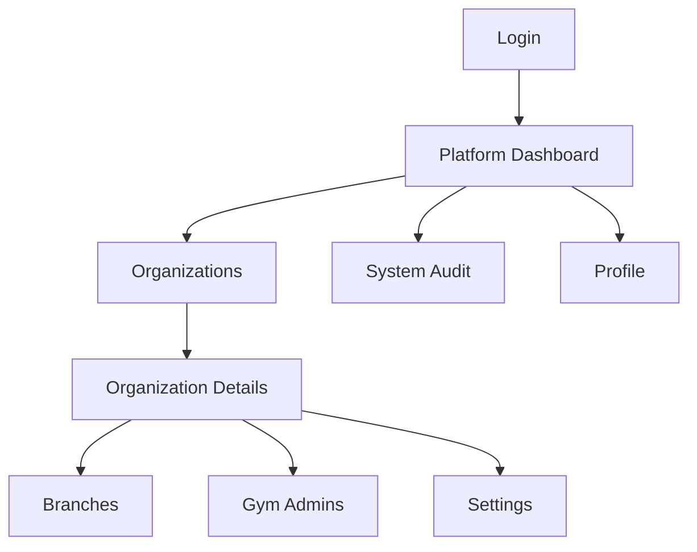

Sidebar items:

- Dashboard;
- Organizations;
- System Audit;
- Profile.

### 4.2. GYM_ADMIN

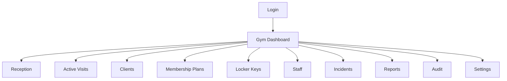

### 4.3. EMPLOYEE

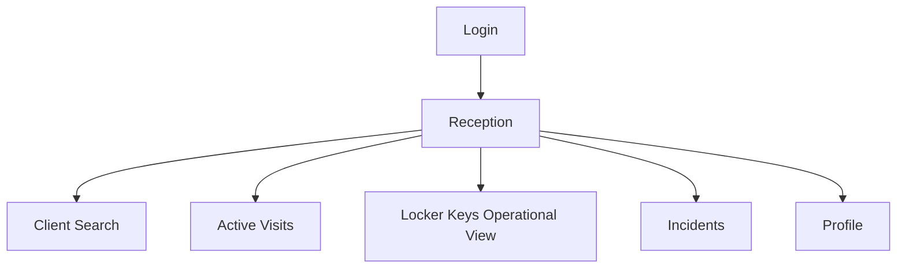

### 4.4. CLIENT — post-MVP

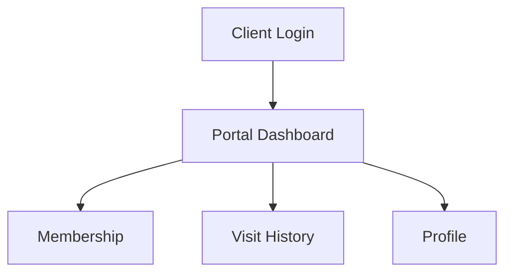

---

## 5. Глобальні сторінкові шаблони

### 5.1. List page template

Мінімальна структура:

1. page header;
2. primary action button;
3. search і filters;
4. table;
5. pagination;
6. empty state;
7. loading state;
8. error state.

HeroUI:

- `Typography`;
- `Button`;
- `SearchField`;
- `Select` / `Autocomplete` / `DateRangePicker`;
- `Table`;
- `Chip`;
- `Pagination`;
- `Skeleton`;
- `Alert`;
- `Card` для empty state.

### 5.2. Details page template

Мінімальна структура:

- breadcrumbs;
- title + status chip;
- primary and secondary actions;
- summary cards;
- `Tabs`;
- activity/history table;
- details drawer/modal for individual records.

### 5.3. Form modal template

HeroUI:

- `Modal`;
- `Form`;
- relevant form fields;
- `FieldError`;
- primary `Button`;
- cancel `Button`;
- `Spinner` inside submit button;
- persistent `Alert` for business rejection.

### 5.4. Destructive confirmation template

HeroUI:

- `AlertDialog`;
- entity summary;
- consequence text;
- optional reason `TextArea`;
- danger action button;
- cancel button.

---

# 6. Public and authentication pages

## 6.1. Staff Login

**Route:** `/login`  
**Stories:** `AUTH-01`, `AUTH-02`, `AUTH-03`

### Purpose

Authenticate SUPER_ADMIN, GYM_ADMIN або EMPLOYEE.

### Minimum HeroUI components

- `Card`;
- `Form`;
- `TextField` + `Input` for email;
- `TextField` + password `Input`;
- `Button`;
- `Alert`;
- `Spinner`;
- `Link` for post-MVP password recovery.

### Fields

| Field | Type | Required | Rules |
|---|---|---:|---|
| Email | email input | yes | normalize lowercase, basic email validation |
| Password | password input | yes | no client-side disclosure of password policy during login |
| Remember session | checkbox | optional | post-MVP or omitted in MVP |

### Actions

- Sign in;
- show/hide password;
- forgot password — post-MVP.

### States

- idle;
- submitting;
- invalid credentials;
- deactivated account;
- organization suspended;
- rate limited;
- API unavailable.

### Flow

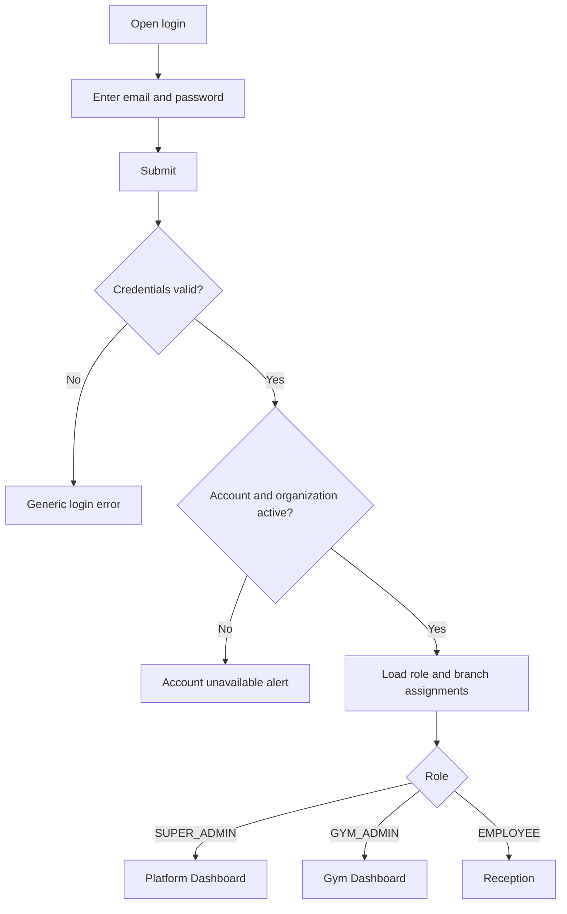

## 6.2. Forbidden Page

**Route:** `/403`

Components:

- `Card`;
- `Alert`;
- `Button` back to allowed dashboard.

## 6.3. Not Found Page

**Route:** `/404`

Components:

- `Card`;
- `Button` to dashboard.

## 6.4. Session Expired Modal

Components:

- `Modal`;
- `Alert`;
- `Button` to login.

Behavior:

- clears local session;
- does not silently lose submitted form without warning;
- optionally stores safe return URL.

---

# 7. SUPER_ADMIN pages

## 7.1. Platform Dashboard

**Route:** `/super-admin/dashboard`  
**Stories:** summary view over `ORG-*`, `BRANCH-*`, `STAFF-01`

### Minimum components

- `Card` summary tiles;
- `Chip` statuses;
- `Table` recent organizations;
- `Table` recent security/audit events;
- `Button` Create Organization;
- `Skeleton` loading;
- `Alert` service issue.

### Minimum widgets

- active organizations;
- suspended organizations;
- total active branches;
- Gym Admin count;
- recently created organizations;
- recent platform audit events.

No charts are required for MVP.

## 7.2. Organizations List

**Route:** `/super-admin/organizations`  
**Stories:** `ORG-01`, `ORG-02`, `ORG-03`

### Minimum components

- `SearchField`;
- status `Select`;
- `Table`;
- `Chip`;
- `Pagination`;
- `Button` Create Organization;
- row `Dropdown` actions.

### Columns

- display name;
- legal name;
- slug;
- timezone;
- branches count;
- Gym Admin count;
- status;
- created at;
- actions.

### Row actions

- View;
- Edit;
- Deactivate/Activate according to policy.

## 7.3. Organization Details

**Route:** `/super-admin/organizations/[organizationId]`  
**Stories:** `ORG-02`, `ORG-03`, `BRANCH-01`, `BRANCH-02`, `STAFF-01`

### Header

- organization name;
- status `Chip`;
- Edit button;
- Deactivate button;
- organization ID optional copy action.

### Tabs

1. Overview;
2. Branches;
3. Gym Admins;
4. Settings;
5. Audit.

### Overview minimum fields

- display name;
- legal name;
- slug;
- timezone;
- status;
- created at;
- updated at;
- branch count;
- admin count.

### Branches tab

- search;
- status filter;
- table;
- Add Branch button.

Columns:

- name;
- code;
- address;
- timezone;
- status;
- staff count;
- active visits optional;
- actions.

### Gym Admins tab

- table with name, email, status, created at;
- Add Gym Admin button.

## 7.4. Create/Edit Organization Modal

**Stories:** `ORG-01`, `ORG-02`

### Components

- `Modal`;
- `Form`;
- `TextField`;
- `Select`;
- `TextArea` optional;
- `Button`.

### Fields

| Field | Component | Required | Notes |
|---|---|---:|---|
| Display name | `TextField` | yes | user-facing name |
| Legal name | `TextField` | yes | may equal display name |
| Slug | `TextField` | yes | unique, lowercase format |
| Timezone | `Autocomplete` | yes | IANA timezone |
| Status | `Select` | yes | default `ACTIVE` |
| Contact email | `TextField` | no | operational contact |
| Contact phone | `TextField` | no | normalized |

### Actions

- Save;
- Cancel.

## 7.5. Deactivate Organization AlertDialog

**Story:** `ORG-03`

Minimum content:

- organization summary;
- affected branches count;
- warning that staff login will be blocked;
- required reason `TextArea` if audit policy requires;
- Confirm Deactivation;
- Cancel.

## 7.6. Create/Edit Branch Modal

**Stories:** `BRANCH-01`, `BRANCH-02`

### Fields

| Field | Component | Required |
|---|---|---:|
| Branch name | `TextField` | yes |
| Branch code | `TextField` | yes |
| Address | `TextArea` | yes |
| Timezone | `Autocomplete` | yes |
| Status | `Select` | yes |
| Phone | `TextField` | no |
| Email | `TextField` | no |

### Deactivate Branch AlertDialog

Must show:

- branch name;
- active visits count;
- issued keys count;
- blocking conditions;
- confirmation.

---

# 8. Gym Dashboard

## 8.1. Gym Dashboard

**Route:** `/app/dashboard`  
**Roles:** GYM_ADMIN  
**Stories:** operational summaries over clients, memberships, visits, keys, incidents.

### Minimum cards

- clients total;
- active memberships;
- active visits now;
- available keys;
- issued keys;
- unresolved incidents.

### Minimum components

- `Card`;
- `Chip`;
- `Table` active visits preview;
- `Table` unresolved incidents preview;
- `Button` Go to Reception;
- `Alert` long-running visits warning.

No chart is mandatory before `REPORT-01`.

---

# 9. Staff management

## 9.1. Staff List

**Route:** `/app/staff`  
**Stories:** `STAFF-01`, `STAFF-02`, `STAFF-03`, `STAFF-04`

### Minimum components

- `SearchField`;
- role `Select`;
- status `Select`;
- branch `Autocomplete`;
- `Table`;
- `Chip`;
- `Pagination`;
- `Button` Add Employee;
- row action `Dropdown`;
- details `Drawer`.

### Columns

- full name;
- email;
- role;
- assigned branches;
- status;
- last login optional;
- created at;
- actions.

## 9.2. Staff Details Drawer

### Sections

- identity;
- role;
- organization;
- branch assignments;
- status;
- created/updated timestamps;
- recent audit events.

### Actions

- Edit;
- Deactivate;
- Reset temporary access — optional.

## 9.3. Create Gym Admin Modal

**Story:** `STAFF-01`

### Fields

| Field | Component | Required |
|---|---|---:|
| First name | `TextField` | yes |
| Last name | `TextField` | yes |
| Email | `TextField` | yes |
| Phone | `TextField` | no |
| Organization | read-only or `Autocomplete` | yes |
| Role | read-only `Chip` = GYM_ADMIN | yes |
| Invitation mode | `RadioGroup` | yes |
| Temporary password | password field | conditional |

Invitation modes:

- generate temporary password;
- send invitation — optional if email integration is not implemented.

## 9.4. Create/Edit Employee Modal

**Stories:** `STAFF-02`, `STAFF-03`

### Fields

| Field | Component | Required |
|---|---|---:|
| First name | `TextField` | yes |
| Last name | `TextField` | yes |
| Email | `TextField` | yes |
| Phone | `TextField` | no |
| Role | read-only `Chip` = EMPLOYEE | yes |
| Branch assignments | `Autocomplete` multi-select or `CheckboxGroup` | yes, at least one |
| Status | `Select` | edit only |

## 9.5. Deactivate Employee AlertDialog

**Story:** `STAFF-04`

Content:

- employee summary;
- affected active sessions;
- session invalidation warning;
- reason optional/required by audit policy;
- confirm.

---

# 10. Client CRM

## 10.1. Clients List

**Route:** `/app/clients`  
**Stories:** `CLIENT-01`, `CLIENT-02`, `CLIENT-03`, `CLIENT-04`, `CLIENT-05`

### Minimum components

- primary `SearchField`;
- status `Select`;
- home branch `Autocomplete`;
- membership status `Select`;
- `Table`;
- `Chip`;
- `Pagination`;
- `Button` Add Client;
- row action `Dropdown`.

### Search behavior

Search by:

- full name;
- phone;
- email;
- client ID.

### Columns

- client name;
- phone;
- email;
- home branch;
- client status;
- membership status;
- last visit;
- actions.

### Row actions

- View profile;
- Start check-in;
- Edit;
- Block/Unblock.

## 10.2. Client Profile

**Route:** `/app/clients/[clientId]`  
**Stories:** `CLIENT-03`, `CLIENT-04`, `CLIENT-05`, `MEMBERSHIP-01..04`, `VISIT-08`, `INCIDENT-*`

### Header

- full name;
- client status `Chip`;
- client ID;
- Check In button;
- Edit button;
- Block/Unblock action.

### Summary cards

- current membership status;
- remaining visits;
- last visit;
- active visit indicator;
- unresolved incidents count.

### Tabs

1. Overview;
2. Memberships;
3. Visit History;
4. Incidents;
5. Audit — GYM_ADMIN only.

### Overview fields

- first name;
- last name;
- phone;
- email;
- home branch;
- notes;
- created at;
- updated at.

### Memberships tab

Table columns:

- plan name;
- type;
- start date;
- end date;
- status;
- visits used/allowed;
- allowed branches;
- actions.

### Visit History tab

Columns:

- started at;
- finished at;
- duration;
- branch;
- key number;
- status;
- check-in employee;
- check-out employee;
- correction indicator;
- actions.

### Incidents tab

Columns:

- type;
- key;
- visit;
- status;
- reported at;
- reported by;
- resolved at.

## 10.3. Create/Edit Client Modal

**Stories:** `CLIENT-01`, `CLIENT-04`

### Fields

| Field | Component | Required | Notes |
|---|---|---:|---|
| First name | `TextField` | yes | |
| Last name | `TextField` | yes | |
| Phone | `TextField` | conditional | at least phone or email |
| Email | `TextField` | conditional | at least phone or email |
| Home branch | `Autocomplete` | no | only allowed branches |
| Date of birth | `DatePicker` | no | optional CRM field |
| Notes | `TextArea` | no | internal only |
| Status | `Select` | edit only | ACTIVE/BLOCKED |

### Duplicate warning flow

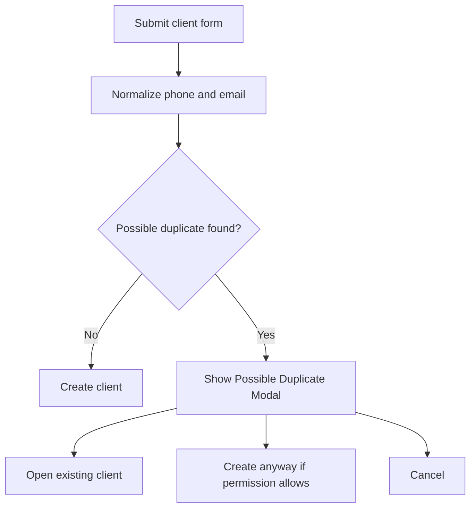

## 10.4. Possible Duplicate Modal

Components:

- `Modal`;
- `Alert` warning;
- `Table` or `Card` list of matches;
- buttons Open Existing, Create Anyway, Cancel.

## 10.5. Block/Unblock Client AlertDialog

**Story:** `CLIENT-05`

Fields:

- reason `TextArea` required for block;
- effective immediately `Checkbox` optional;
- confirmation.

Must warn that blocked client cannot check in.

---

# 11. Membership management

## 11.1. Membership Plans List

**Route:** `/app/membership-plans`  
**Story:** `PLAN-01`

### Minimum components

- `SearchField`;
- type `Select`;
- active status `Select`;
- `Table`;
- `Chip`;
- `Pagination`;
- `Button` Create Plan;
- edit `Modal`.

### Columns

- name;
- type;
- validity period;
- visit limit;
- allowed branches;
- status;
- clients assigned count optional;
- actions.

## 11.2. Create/Edit Membership Plan Modal

### Fields

| Field | Component | Required | Rules |
|---|---|---:|---|
| Name | `TextField` | yes | |
| Type | `Select` | yes | UNLIMITED, VISIT_LIMIT, SINGLE_VISIT, TRIAL |
| Validity value | `NumberField` | yes | positive |
| Validity unit | `Select` | yes | days/months |
| Visit limit | `NumberField` | conditional | required for limited types |
| Allowed branches | `Autocomplete` multi-select | yes | at least one or all branches policy |
| Active | `Switch` | yes | default on |
| Description | `TextArea` | no | |

## 11.3. Assign Membership Modal

**Story:** `MEMBERSHIP-01`

Opened from Client Profile.

### Fields

| Field | Component | Required |
|---|---|---:|
| Client | read-only summary | yes |
| Membership plan | `Autocomplete` | yes |
| Start date | `DatePicker` | yes |
| End date | calculated/read-only, optionally editable by policy | yes |
| Allowed visits | `NumberField` | conditional |
| Allowed branches | read-only from plan or controlled override | yes |
| Notes | `TextArea` | no |

### Warnings

- overlapping membership;
- client blocked;
- plan inactive;
- selected date outside policy.

## 11.4. Freeze Membership Modal

**Story:** `MEMBERSHIP-03`

Fields:

- freeze start date;
- freeze end date;
- reason;
- whether end date shifts according to policy — read-only explanation.

## 11.5. Cancel Membership AlertDialog

Fields:

- cancellation date;
- reason required;
- refund/payment fields are out of MVP.

## 11.6. Eligibility indicator

**Story:** `MEMBERSHIP-02`

Shown in:

- Client Profile;
- Reception search results;
- Check-in Modal.

HeroUI:

- `Chip` ACTIVE/FROZEN/EXPIRED/BLOCKED;
- `Alert` for rejection reason;
- `Tooltip` for technical/business reason explanation.

---

# 12. Locker key inventory

## 12.1. Locker Keys Page

**Route:** `/app/locker-keys`  
**Stories:** `KEY-01`, `KEY-02`, `KEY-03`

### Minimum components

- `SearchField` by key or locker number;
- branch `Autocomplete`;
- status `Select`;
- `Table`;
- `Chip`;
- `Pagination`;
- `Button` Add Key;
- row action `Dropdown`;
- details `Drawer`.

### Columns

- key number;
- locker number;
- branch;
- status;
- assigned client if issued;
- active visit start if issued;
- updated at;
- actions.

### Status colors

- AVAILABLE — success;
- ISSUED — accent;
- LOST — danger;
- DAMAGED — warning;
- MAINTENANCE — warning;
- DEACTIVATED — default.

## 12.2. Add/Edit Locker Key Modal

### Fields

| Field | Component | Required |
|---|---|---:|
| Key number | `TextField` | yes |
| Locker number | `TextField` | yes |
| Branch | `Autocomplete` | yes |
| Initial status | read-only AVAILABLE on create | yes |
| Notes | `TextArea` | no |

## 12.3. Change Key Status Modal

**Story:** `KEY-03`

Fields:

- current status read-only;
- new status `Select` constrained by state machine;
- reason `TextArea` required;
- linked visit/client summary if issued.

The UI must not allow invalid transitions, but backend remains authoritative.

### Key state machine

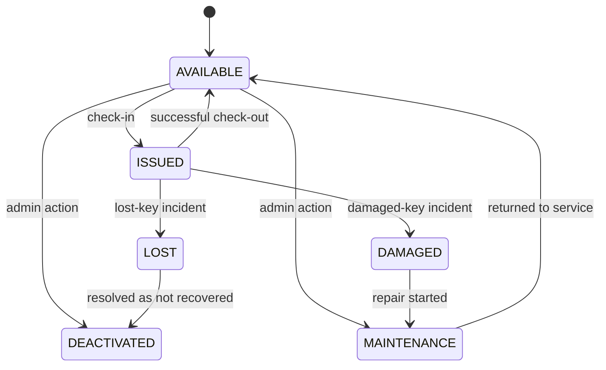

## 12.4. Key Details Drawer

Shows:

- key and locker number;
- branch;
- current status;
- current assignment;
- linked active visit;
- status history;
- incidents;
- audit records.

---

# 13. Reception and core operations

## 13.1. Reception Page

**Route:** `/app/reception`  
**Stories:** `CLIENT-02`, `MEMBERSHIP-02`, `VISIT-01..07`

This is the main EMPLOYEE page.

### Minimum layout

1. branch context;
2. large client search;
3. client search results;
4. quick checkout by key;
5. active visits preview;
6. key availability summary.

### HeroUI components

- `SearchField` or `ComboBox` for client search;
- `Card` for client result;
- `Chip` for client and membership statuses;
- `Button` Check In;
- `Button` Check Out by Key;
- `Table` active visits preview;
- `Alert` for no available keys;
- `Skeleton`;
- `Modal` check-in/check-out.

### Client result card minimum

- full name;
- phone/email;
- client status;
- membership status;
- remaining visits;
- last visit;
- active visit warning;
- Check In button.

### Quick checkout block

- key number input;
- Search/Continue button;
- result summary;
- opens Checkout Modal.

## 13.2. Check-in flow

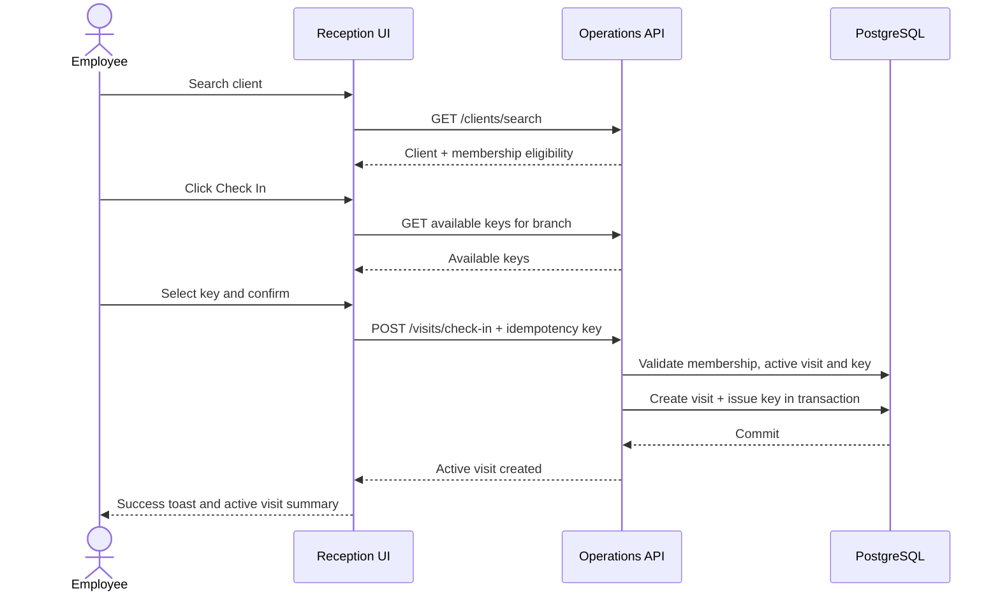

## 13.3. Check-in Modal

**Stories:** `VISIT-01`, `VISIT-02`, `VISIT-03`, `VISIT-04`

### Components

- `Modal`;
- client `Card`;
- membership `Alert`/`Chip`;
- key `Autocomplete`;
- `DatePicker` + `TimeField` or timestamp field;
- `Checkbox` manual time override if permission allows;
- `Button` Confirm Check-in;
- `Alert` concurrency/business errors.

### Fields

| Field | Component | Required | Notes |
|---|---|---:|---|
| Client | read-only card | yes | selected before modal |
| Branch | read-only or allowed selector | yes | current context |
| Membership | read-only eligibility summary | yes | revalidated on submit |
| Locker key | `Autocomplete` | yes | only AVAILABLE in current branch |
| Start date/time | `DatePicker` + `TimeField` | yes | defaults to now |
| Manual time override | `Checkbox` | conditional | permission-based |
| Notes | `TextArea` | no | operational note |

### Confirmation summary

Must show:

- client;
- branch;
- membership;
- selected key;
- start timestamp;
- visit count consumption impact.

### Error states

- membership expired/frozen/blocked;
- client blocked;
- client already has active visit;
- key already issued;
- stale key list;
- branch mismatch;
- duplicate idempotent request;
- network failure after submit.

## 13.4. Check-in Success

Use:

- success `Toast`;
- optional success `Modal` only if key handoff summary must remain visible.

Display:

- client;
- key number;
- locker number;
- start time;
- active visit ID optional.

## 13.5. Active Visits Page

**Route:** `/app/active-visits`  
**Story:** `VISIT-05`

### Minimum components

- branch `Autocomplete`;
- client `SearchField`;
- duration warning filter `Select`;
- `Table`;
- `Chip`;
- `Pagination`;
- `Button` Check Out by Key;
- details `Drawer`.

### Columns

- client;
- key number;
- locker number;
- branch;
- started at;
- current duration;
- membership;
- check-in employee;
- warning status;
- actions.

### Actions

- View visit;
- Check out;
- Report lost key;
- Report damaged key;
- Correct visit — GYM_ADMIN only.

### Long-running indicator

- warning `Chip` after configured threshold;
- `Alert` summary at page top;
- no silent auto-close in UI.

## 13.6. Checkout by Key Modal

**Story:** `VISIT-06`, `VISIT-07`

### Step 1: find key

Fields:

- branch read-only/current;
- key number `TextField` or `ComboBox`;
- Continue button.

### Step 2: confirmation

Read-only summary:

- key number;
- client;
- visit start;
- current duration;
- membership;
- check-in employee.

Fields:

- finish date/time default now;
- manual override conditional;
- notes optional.

Actions:

- Confirm Check-out;
- Cancel;
- Report Key Problem.

### Flow

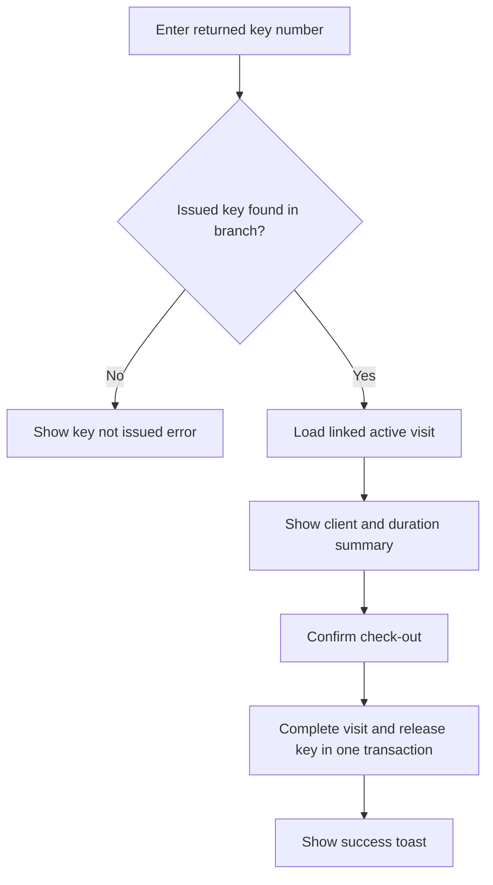

### Error states

- key not found;
- key available but no active assignment;
- visit already completed;
- stale state/concurrent checkout;
- key branch mismatch;
- invalid finish time;
- request completed but response lost — idempotent retry.

## 13.7. Visit Details Drawer/Page

**Route:** `/app/visits/[visitId]` or drawer from tables  
**Stories:** `VISIT-05`, `VISIT-08`, `VISIT-09`

### Sections

- status;
- client;
- membership snapshot;
- branch;
- key assignment;
- start/end/duration;
- check-in employee;
- check-out employee;
- correction history;
- incidents;
- audit timeline.

### Actions

- Check out if ACTIVE;
- Correct Visit — GYM_ADMIN;
- Report Incident;
- Open Client Profile.

### Visit state machine

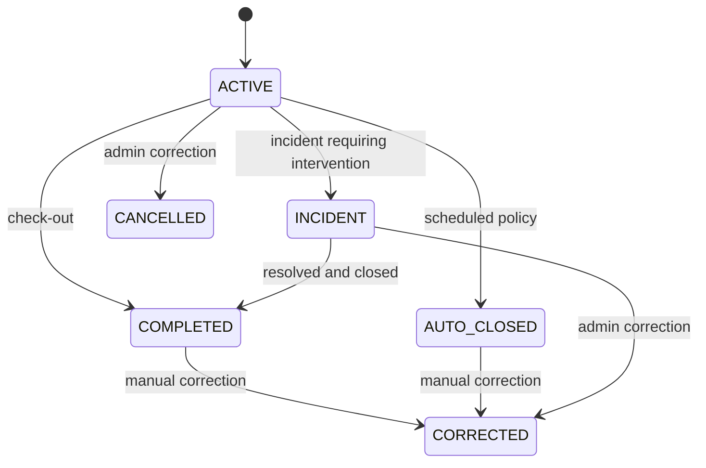

## 13.8. Correct Visit Modal

**Story:** `VISIT-09`

### Fields

| Field | Component | Required |
|---|---|---:|
| Original values | read-only card | yes |
| Start date | `DatePicker` | yes |
| Start time | `TimeField` | yes |
| End date | `DatePicker` | conditional |
| End time | `TimeField` | conditional |
| Visit status | `Select` | yes |
| Locker key | `Autocomplete` | conditional |
| Membership consumption adjustment | `RadioGroup` or read-only policy result | yes |
| Correction reason | `TextArea` | yes |
| Override conflict | `Checkbox` | permission-based |

### Validation

- no negative duration;
- no key overlap without override;
- no invalid state transition;
- reason mandatory;
- original values remain visible in audit.

## 13.9. Auto-close review

**Story:** `VISIT-10`

No separate page is required.

UI minimum:

- long-running `Chip` in Active Visits;
- `Alert` with count;
- filter `Long-running only`;
- visit details show auto-close policy status;
- AUTO_CLOSED status visible in history.

---

# 14. Incident management

## 14.1. Incidents Page

**Route:** `/app/incidents`  
**Stories:** `INCIDENT-01`, `INCIDENT-02`, `INCIDENT-03`

### Minimum components

- `SearchField`;
- incident type `Select`;
- status `Select`;
- branch `Autocomplete`;
- `DateRangePicker`;
- `Table`;
- `Chip`;
- `Pagination`;
- `Button` Report Incident;
- details `Drawer`.

### Columns

- incident ID;
- type;
- client;
- key;
- visit;
- branch;
- status;
- reported by;
- reported at;
- resolved at;
- actions.

## 14.2. Report Incident Modal

### Incident type

Use `RadioGroup` or `Select`:

- LOST_KEY;
- DAMAGED_KEY;
- INCORRECT_ASSIGNMENT;
- CLIENT_LEFT_WITH_KEY;
- OTHER.

### Fields

| Field | Component | Required |
|---|---|---:|
| Incident type | `Select` | yes |
| Branch | read-only/current or `Autocomplete` | yes |
| Key | `ComboBox` | conditional |
| Active visit | read-only linked summary | conditional |
| Client | read-only linked summary | conditional |
| Action on visit | `RadioGroup` | conditional |
| Notes/reason | `TextArea` | yes |

### Lost key flow

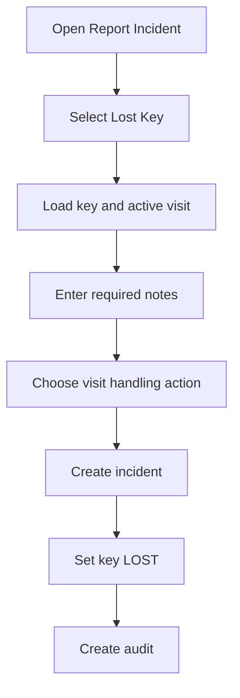

## 14.3. Incident Details Drawer

Shows:

- type/status;
- linked client/visit/key;
- reporter;
- notes;
- created/resolved timestamps;
- resolution;
- audit timeline.

## 14.4. Resolve Incident Modal

**Story:** `INCIDENT-03`

Fields:

- resolution status `Select`;
- key final status `Select`;
- visit final action `Select` if still active;
- resolution notes `TextArea` required;
- recovered date/time optional.

---

# 15. Audit

## 15.1. Audit Page

**Routes:**

- `/app/audit` — GYM_ADMIN;
- `/super-admin/audit` — SUPER_ADMIN.

**Stories:** `AUDIT-01`, `AUDIT-02`

### Minimum components

- `DateRangePicker`;
- actor `Autocomplete`;
- entity type `Select`;
- event type `Autocomplete`;
- branch `Autocomplete`;
- correlation ID `SearchField`;
- `Table`;
- `Pagination`;
- `Chip`;
- details `Drawer`.

### Columns

- timestamp;
- actor;
- event type;
- entity type;
- entity ID;
- branch;
- result;
- correlation ID;
- actions.

### Audit Details Drawer

Shows:

- full timestamp UTC and local;
- actor;
- organization/branch;
- event type;
- entity;
- old values;
- new values;
- reason;
- correlation ID;
- request/source metadata allowed by security policy.

Use `Accordion` for old/new JSON sections.

No edit/delete actions.

---

# 16. Reports

## 16.1. Reports Landing

**Route:** `/app/reports`

Components:

- `Card` links to reports;
- last updated timestamp;
- reporting freshness `Chip`;
- `Alert` if data is delayed.

Cards:

- Daily Visits;
- Key Status;
- Employee Activity.

## 16.2. Daily Visits Report

**Route:** `/app/reports/daily-visits`  
**Story:** `REPORT-01`

### Filters

- date `DatePicker`;
- branch `Autocomplete`;
- include active visits `Checkbox`;
- timezone indicator.

### Minimum summary cards

- total visits;
- completed;
- active;
- average duration;
- corrections;
- incidents.

### Minimum data views

- visits by hour;
- visits by branch;
- detailed visits table.

HeroUI:

- `Card`;
- `Table`;
- `Chip`;
- `Tabs` optional between Summary and Details;
- `Skeleton`;
- `Alert`.

A chart library may be added later, but table/card representation is sufficient for MVP.

## 16.3. Key Status Report

**Route:** `/app/reports/key-status`  
**Story:** `REPORT-02`

### Filters

- branch;
- status;
- date/time snapshot if historical reporting exists.

### Summary

- available;
- issued;
- lost;
- damaged;
- maintenance;
- deactivated.

### Table columns

- key;
- locker;
- branch;
- status;
- current client;
- current visit;
- status changed at.

## 16.4. Employee Activity Report

**Route:** `/app/reports/employee-activity`  
**Story:** `REPORT-03`

### Filters

- date range;
- branch;
- employee;
- action type.

### Summary

- check-ins;
- check-outs;
- corrections;
- incidents created;
- average actions per shift optional.

### Table columns

- employee;
- branch;
- check-ins;
- check-outs;
- corrections;
- incidents;
- last action.

## 16.5. Eventual consistency indicator

**Story:** `EVENT-02`, Phase 18.

Shown in report headers:

- `Chip` Fresh / Updating / Delayed;
- last updated timestamp;
- optional `ProgressCircle` while refreshing;
- `Alert` when reporting SLA exceeded;
- Refresh button.

Operational check-in/check-out UI must not wait for reporting refresh.

---

# 17. Settings and profile

## 17.1. Organization Settings

**Route:** `/app/settings/organization`  
**Role:** GYM_ADMIN

Fields:

- organization display name read-only or editable by permission;
- default timezone;
- contact email;
- contact phone;
- operational settings placeholders.

HeroUI:

- `Tabs`;
- `Form`;
- `TextField`;
- `Autocomplete` timezone;
- `Button` Save;
- `Alert`.

No billing/payment settings in MVP.

## 17.2. Branch Settings

**Route:** `/app/settings/branches/[branchId]`

Fields:

- name;
- code;
- address;
- timezone;
- contact info;
- long-running visit threshold;
- manual time override permission policy optional.

## 17.3. Profile

**Route:** `/app/profile`

Fields:

- first name;
- last name;
- email read-only in MVP;
- phone;
- role read-only;
- organization;
- branch assignments;
- change password form optional.

---

# 18. Client Portal — optional post-MVP

## 18.1. Client Login

**Route:** `/portal/login`  
**Story:** `PORTAL-01`

Components and fields mirror staff login but use separate auth context.

Fields:

- email/phone or portal identifier;
- password;
- sign in.

Client must never receive staff permissions or internal notes.

## 18.2. Client Portal Dashboard

**Route:** `/portal/dashboard`

Minimum components:

- membership status `Card`;
- visits remaining;
- membership dates;
- last visit;
- recent visits table;
- profile button.

## 18.3. Client Visit History

**Route:** `/portal/visits`  
**Story:** `PORTAL-02`

Filters:

- date range;
- branch.

Columns:

- date;
- branch;
- start;
- finish;
- duration.

Must not show:

- internal notes;
- staff audit;
- correction reasons not intended for client;
- other clients.

---

# 19. Global modal and drawer inventory

## 19.1. Required MVP modals

| Modal | Related stories |
|---|---|
| Create/Edit Organization | `ORG-01`, `ORG-02` |
| Deactivate Organization | `ORG-03` |
| Create/Edit Branch | `BRANCH-01`, `BRANCH-02` |
| Create Gym Admin | `STAFF-01` |
| Create/Edit Employee | `STAFF-02`, `STAFF-03` |
| Deactivate Employee | `STAFF-04` |
| Create/Edit Client | `CLIENT-01`, `CLIENT-04` |
| Possible Duplicate | `CLIENT-01` |
| Block/Unblock Client | `CLIENT-05` |
| Create/Edit Membership Plan | `PLAN-01` |
| Assign Membership | `MEMBERSHIP-01` |
| Freeze Membership | `MEMBERSHIP-03` |
| Add/Edit Key | `KEY-01` |
| Change Key Status | `KEY-03` |
| Check-in | `VISIT-01..04` |
| Checkout by Key | `VISIT-06`, `VISIT-07` |
| Correct Visit | `VISIT-09` |
| Report Incident | `INCIDENT-01`, `INCIDENT-02` |
| Resolve Incident | `INCIDENT-03` |
| Session Expired | `AUTH-03` |

## 19.2. Required drawers

- Staff Details;
- Locker Key Details;
- Visit Details;
- Incident Details;
- Audit Details.

Drawers preserve list context and are preferred for read-only details.

---

# 20. Global states

## 20.1. Loading

Use:

- `Skeleton` for page/table layout;
- `Spinner` for local action;
- disabled submit button during request.

Do not show a blank page during data load.

## 20.2. Empty

Each list requires an empty state.

Examples:

- no clients;
- no active visits;
- no available keys;
- no incidents;
- no audit events;
- no report data.

Use:

- `Card`;
- `Typography`;
- optional primary action button.

## 20.3. Validation error

Use inline `FieldError` below the field.

Form-level `Alert` only when:

- multiple fields are affected;
- business validation failed;
- API returned a non-field error.

## 20.4. Business rejection

Use persistent `Alert` with:

- user-friendly explanation;
- reason code in collapsible technical details optional;
- next allowed action.

Examples:

- membership expired;
- key already issued;
- client blocked;
- organization suspended.

## 20.5. Concurrency conflict

Use `Alert` or dedicated conflict modal.

Message should state that data changed since the screen was loaded.

Actions:

- Reload data;
- Close;
- retry only when operation is safe and idempotent.

## 20.6. Network uncertainty after submit

For check-in/check-out:

- do not assume failure if response is lost;
- show “Checking operation status” state;
- retry with same idempotency key;
- display final authoritative state.

---

# 21. Status vocabulary

## 21.1. Organization/Branch/Staff/Client

- ACTIVE;
- INACTIVE or DEACTIVATED;
- BLOCKED where applicable.

## 21.2. Membership

- ACTIVE;
- FROZEN;
- EXPIRED;
- BLOCKED;
- CANCELLED.

## 21.3. Locker Key

- AVAILABLE;
- ISSUED;
- LOST;
- DAMAGED;
- MAINTENANCE;
- DEACTIVATED.

## 21.4. Visit

- ACTIVE;
- COMPLETED;
- CANCELLED;
- AUTO_CLOSED;
- INCIDENT;
- CORRECTED.

## 21.5. Incident

- OPEN;
- IN_REVIEW;
- RESOLVED;
- CLOSED.

All statuses use `Chip` with consistent color mapping across the application.

---

# 22. Story-to-screen traceability

| Story group | Primary pages/modals |
|---|---|
| `AUTH-01..05` | Login, global shell, branch selector, 403, session modal |
| `ORG-01..03` | Organizations List, Organization Details, Organization modals |
| `BRANCH-01..02` | Organization Details → Branches tab, Branch modal |
| `STAFF-01..04` | Staff List, Staff Drawer, Staff modals |
| `CLIENT-01..05` | Clients List, Client Profile, Client modals |
| `PLAN-01` | Membership Plans page and modal |
| `MEMBERSHIP-01..04` | Client Profile → Memberships tab, Assign/Freeze modals, Check-in eligibility UI |
| `KEY-01..03` | Locker Keys page, Key Drawer, Key modals |
| `VISIT-01..04` | Reception, Check-in Modal |
| `VISIT-05` | Active Visits page |
| `VISIT-06..07` | Checkout by Key Modal |
| `VISIT-08` | Client Profile → Visit History |
| `VISIT-09` | Visit Details, Correct Visit Modal |
| `VISIT-10` | Active Visits warning/filter, Visit Details |
| `INCIDENT-01..03` | Incidents page, Report/Resolve modals |
| `AUDIT-01..02` | Audit page, Audit Drawer, entity audit tabs |
| `REPORT-01..03` | Reports Landing and three report pages |
| `PORTAL-01..02` | Client Portal Login, Dashboard, Visit History |
| `EVENT-01..02` | Report freshness indicator, no operational blocking UI |

---

# 23. Minimum testability requirements for UI

1. Use accessible labels for every field.
2. Buttons have stable visible names.
3. Tables have accessible names.
4. Modal titles are unique and stable.
5. Avoid selectors based on Tailwind classes.
6. Use semantic Playwright locators first:
   - `getByRole`;
   - `getByLabel`;
   - `getByText` only for stable copy.
7. Add `data-testid` only where semantic locator is insufficient.
8. Loading state must be observable.
9. Success and error toasts must have stable role/status.
10. Concurrency conflict must have a distinct error code or accessible label.
11. Search results must expose stable client/key identifiers.
12. Every destructive dialog must have separate confirm and cancel actions.
13. UI test data setup should use API where UI setup is not the subject of the test.

Recommended test IDs only where needed:

```text
client-search-results
active-visits-table
available-key-picker
checkin-confirm
checkout-confirm
concurrency-alert
report-freshness-status
```

---

# 24. Minimum UI implementation order

```text
1. Global HeroUI theme and application shell
2. Login and role routing
3. Organization and branch administration
4. Staff management
5. Client CRM
6. Membership plans and assignment
7. Locker key inventory
8. Reception client search
9. Check-in modal
10. Active visits
11. Checkout by key modal
12. Client visit history
13. Incident management
14. Visit correction
15. Audit
16. Reports
17. Settings/profile
18. Optional Client Portal
19. Eventual consistency indicators
```

Each page is considered UI-complete only when it has:

- happy path;
- loading state;
- empty state;
- validation state;
- business rejection state;
- permission state;
- basic responsive behavior;
- Playwright-friendly semantics.

---

# 25. Out of scope for MVP UI

Do not add before explicit approval:

- payments and billing;
- trainer schedules;
- class booking;
- inventory beyond locker keys;
- mobile native app;
- QR/barcode scanning;
- biometric access;
- client self-registration;
- advanced chart dashboard;
- dark mode as a blocking requirement;
- complex drag-and-drop;
- custom design system replacing HeroUI.


## API contract usage in UI implementation

Canonical frontend/backend contracts are defined in `api-requirements.md`.

For every screen/overlay implementation:

- resolve related stories from `ui-contract.md`;
- resolve the stories' `API-*` IDs from `requirements.md`;
- use typed API wrappers generated/validated against OpenAPI;
- map documented problem `code` values to explicit UI states;
- do not branch on localized error text;
- preserve idempotency keys across uncertain network retries;
- use ETag/If-Match for edit forms;
- show correlation ID in unexpected error states;
- refresh list/detail state after concurrency conflict.
